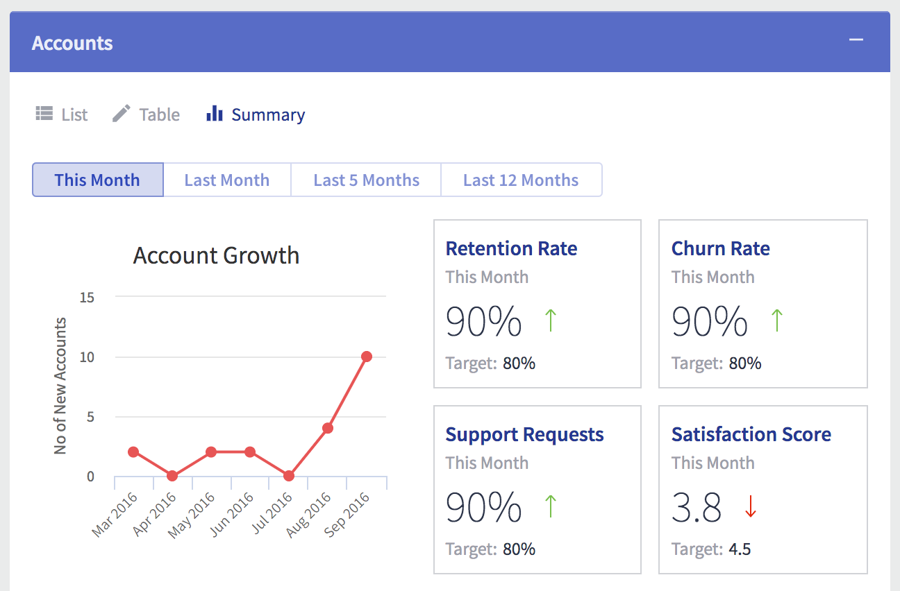
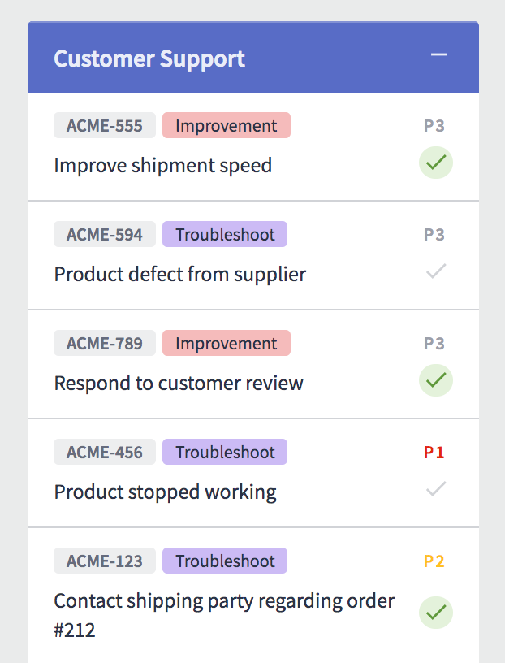
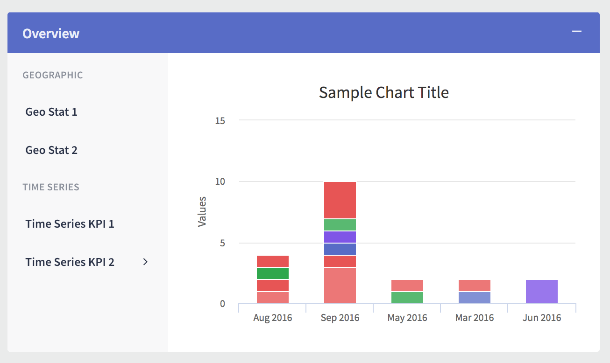
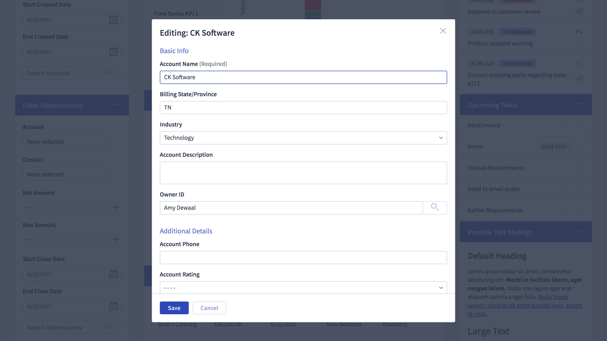

# Compact Data Workspace

## Description
The Compact Data Workspace design system is compact, practical, with plenty of views for data entry, data visualization, and data analysis. Easy to read, filter and scan lots of data.

## Preview
[Preview Compact Data Workspace design system](https://portal.skuidsite.com/designsystems/compact-data-workspace)

## Example Screenshots

#### Full Page
[View screenshot of the full demo page](Screenshots/full_page.png)

#### Account Dashboard

#### Support Tickets

#### Overview/KPIs/Summary

#### Edit Record Modal

## Features
- Customized components: table, charts, tab set, filters, buttons, form, accordion, vertical nav, text, header, wrapper, list, deck.
- Standard spacing and typography default variables are scaled down to increase page density.
- Use of tab set for view switcher to help with providing various views for the same data.
- Use of "Configure View" sliding panel to hide left and right sidebar if needed.

## Usage
- API: v2
- Design System: Download [Compact Data Workspace Design System](CompactDataWorkspace.designsystem) and import it to Skuid's Design Systems.
- Demo page: Download the [Demo Page](CompactDataWorkspace_DemoPage.xml). In Skuid, create a new page and select Import XML file to import this demo page.

## Notes
- For usage in Salesforce, this design system works for version [Spark Update 3](https://docs.skuid.com/v12.4.2/v2/en/release-notes.html) or higher. Older versions of Skuid can result in styling losses.
- The Demo Page uses standard Salesforce objects (Accounts, Contacts, Opportunities, Tasks).
