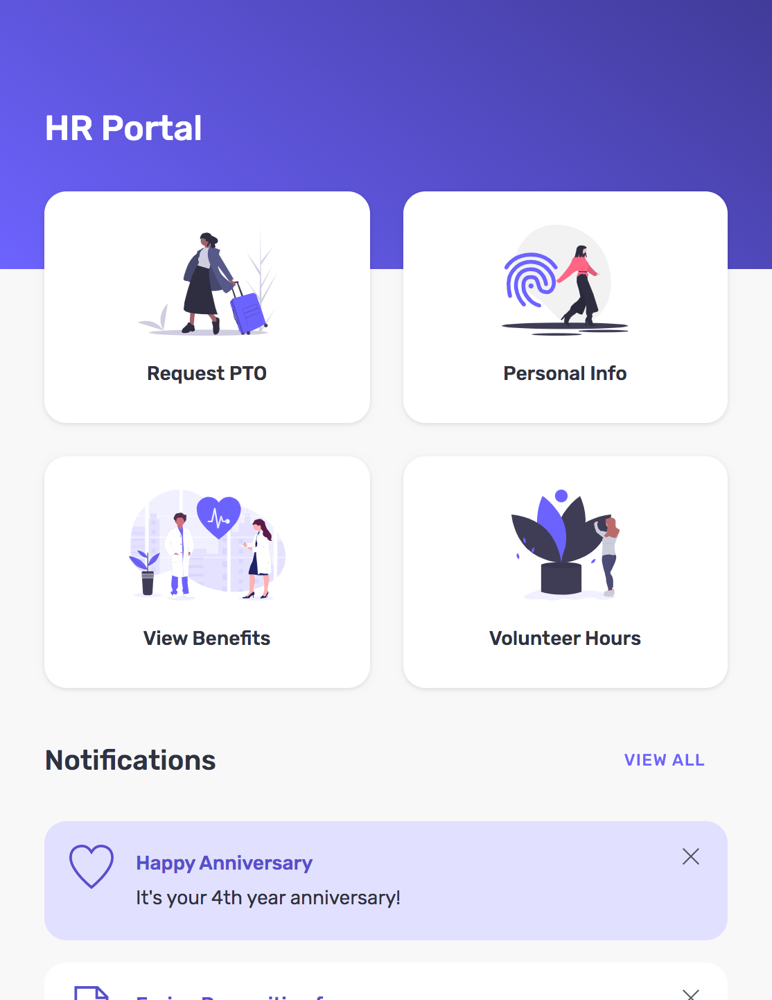
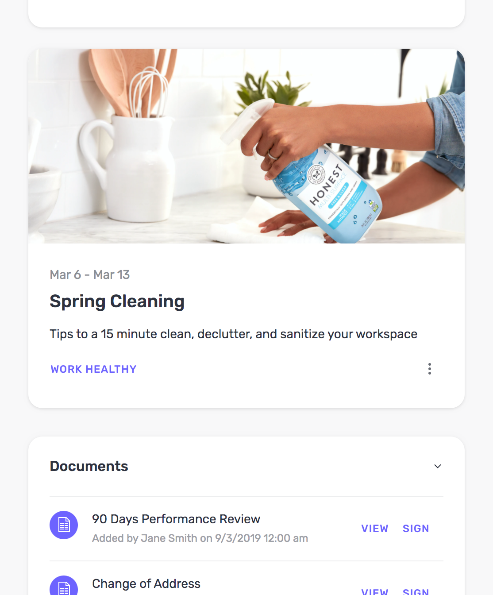
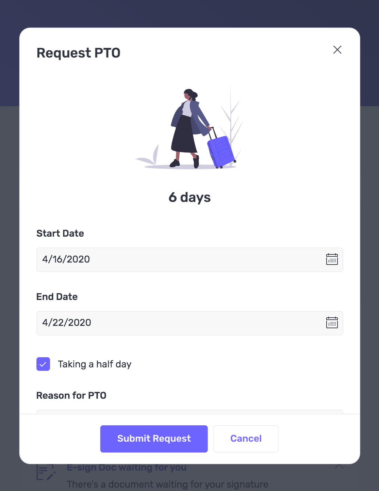
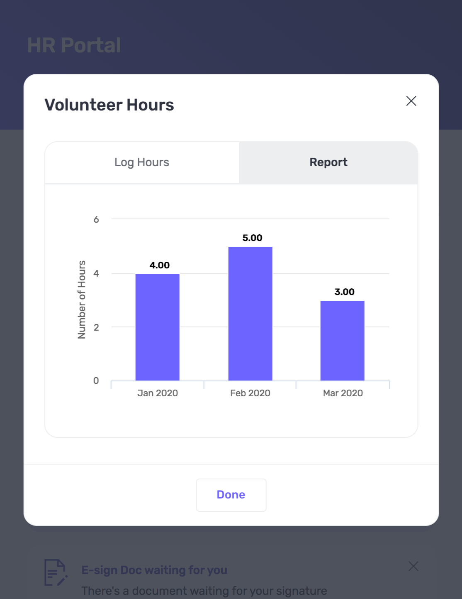
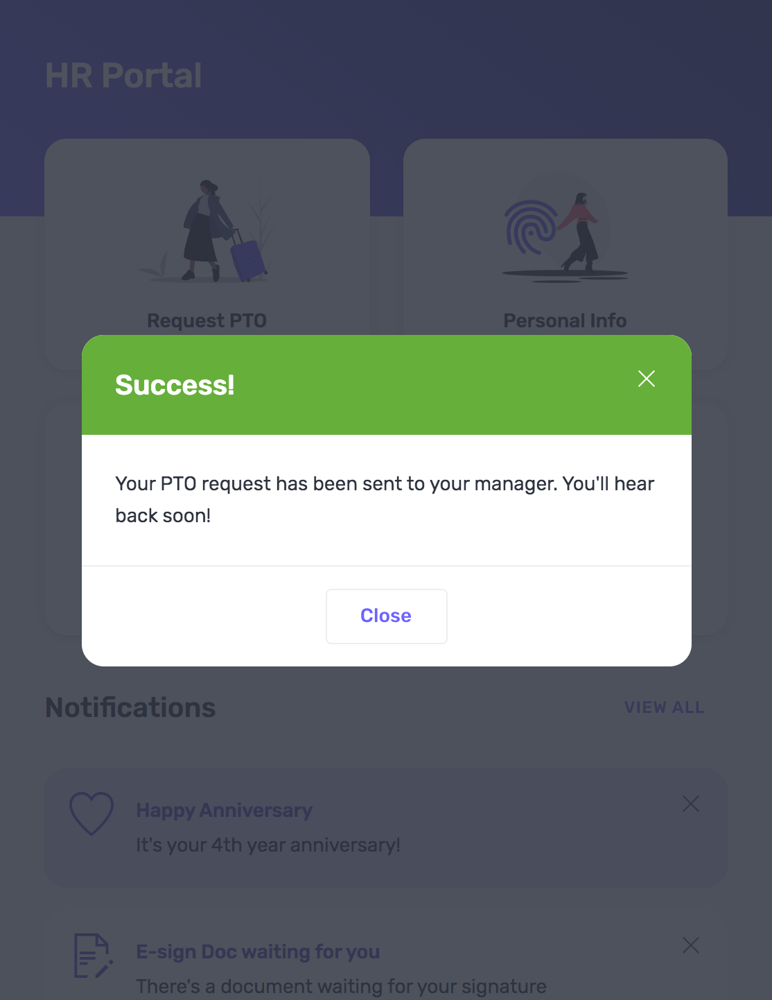

# HR Mobile Portal 

## Description
The HR Mobile Portal design system is hip and trendy, familiar and similar to personal mobile app, featuring bold colors, lots of imagery, and a human-friendly font option. 
*Demo Page coming soon*

## Example Screenshots
**Quick Actions**

**News**

**Full Page Form**

**Chart**

**Success Modal**

## Features
- Customized components: form, list, accordion, buttons, message area, text, modal, image, deck, tab set, tab container.
- Components are built with generous padding and lots of white space, optimizing for a refreshing user experience.
- Integration of images and illustrations make for an visually interesting app.

## Usage
- Download the [HR Portal Design System](HR_Portal.designsystem) and [Demo Page](HRPortal_DemoPage.xml)
- Import the design system and demo page to your Skuid instance

## Notes
Illustrations by [undraw](https://undraw.co/).

