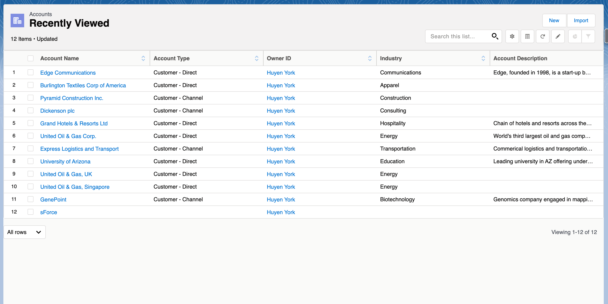
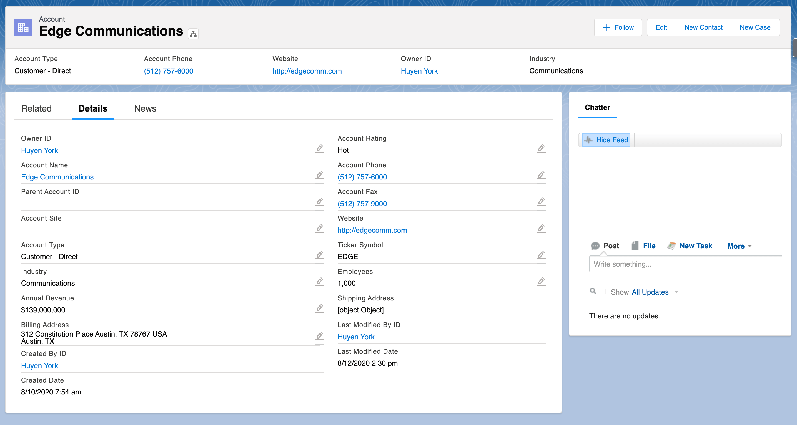

# Lightning Design System

## Description
A matching design system for Skuid builders who create apps to match Salesforce's [Lightning Design System](https://www.lightningdesignsystem.com/). This design system is one of the default design systems in Skuid, so you don't have to import it. You can create a cloned version to make customizations.

In this folder, you'll find a few sample pages that closely match the more common tabs in Salesforce like List view and Detail view. You can use these sample pages as a reference guide or starter pages.

## Screenshots
### List View

### Detail View

