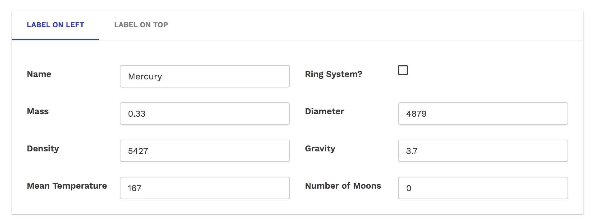
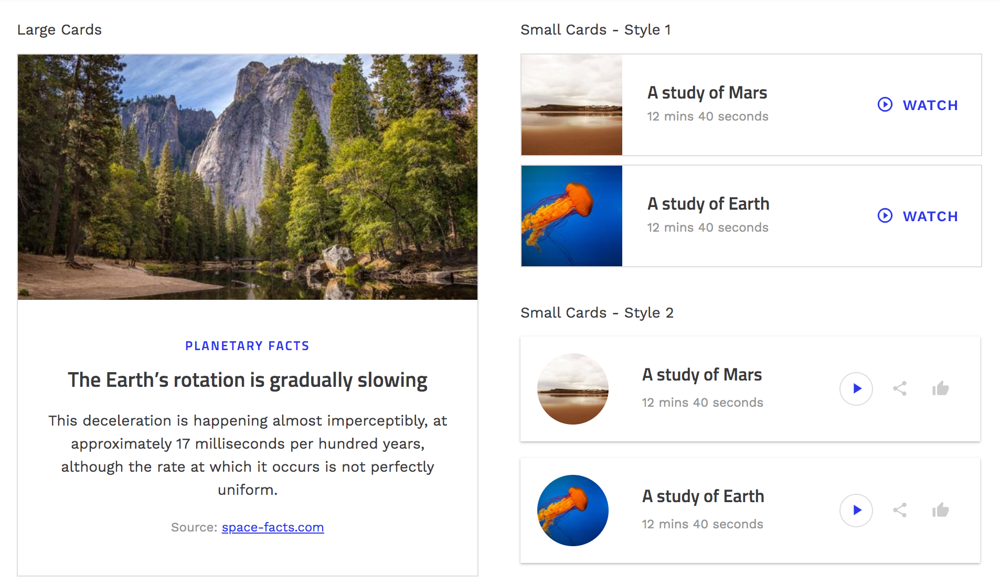
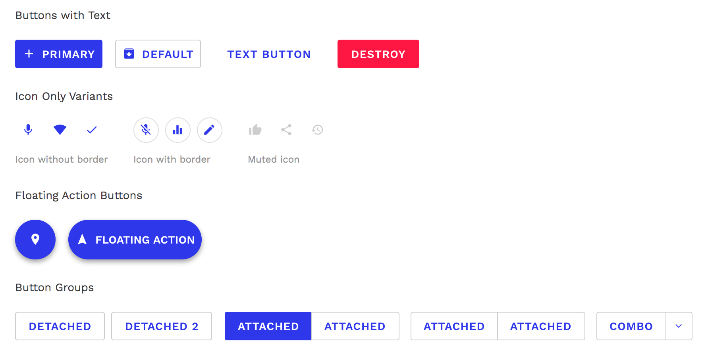
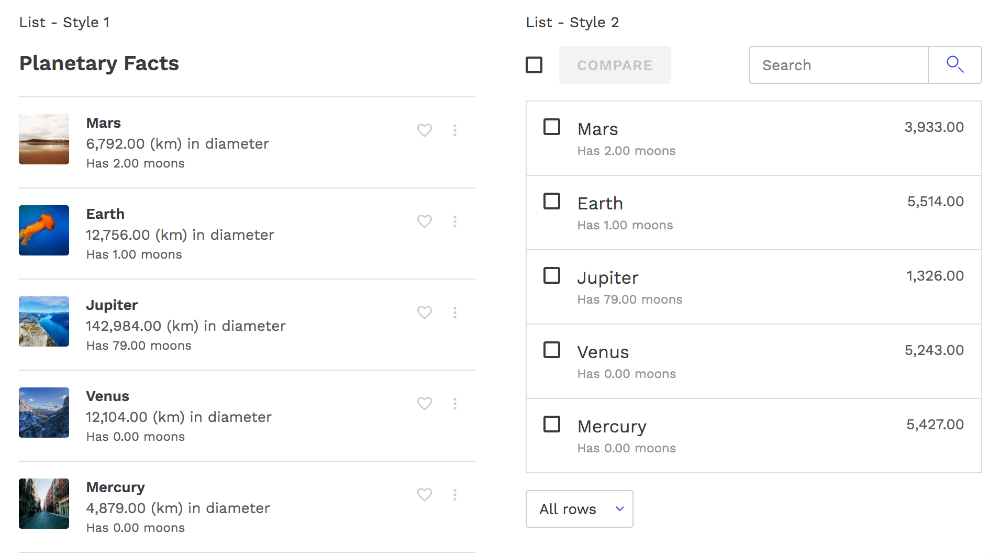

# Material Design

## Description
A Skuid design system for web apps that follow [Material design guidelines](https://material.io/design).

## Preview
[Preview Material design system](https://portal.skuidsite.com/designsystems/material)

## Example Screenshots
#### Form

#### Card

#### Button

#### List

## Features
- Components are customized to closely follow Material design guidelines.
- Custom variants created to support various styles options for card and list.
- Integration of images and illustrations make for an visually interesting app.

## Usage
- API: v2
- Design System: Download [Material Design System](Material.designsystem) and import it to Skuid's Design Systems.
- Demo page: Download the [Demo Page](Material_DesignSystem_DemoPage.xml). In Skuid, create a new page and select Import XML file to import this demo page.

## Notes
- For usage in Salesforce, this design system works for version [Spark Update 3](https://docs.skuid.com/v12.4.2/v2/en/release-notes.html) or higher. Older versions of Skuid can result in styling losses.
- Ui only data
