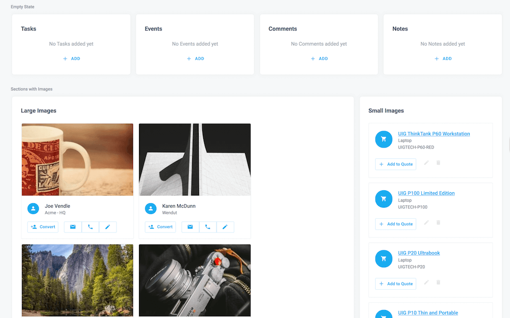

# Example Design System and Style Guide Page

Use a component-filled Skuid page to preview components and re-usable patterns to build a style guide for your Skuid project.

</img>

This page is built as a style guide for a sales application so you may see components or re-usable patterns that are relevant to this type of UI. However, for your project, you may have a different sets of patterns and components that work together to make up your Style Guide.

## Instructions:  
- V2 Page API Used
- Data source: Uses default Salesforce data source
- Design system: [Download this Design System file](salesAppStyleGuide.designsystem).  Use the Import function on the Design System page to add this system to your org. 
- Page XML:  [Copy the XML from this page](salesAppStyleGuide.xml), or save it as an XML file, and upload it as a new page in your Salesforce Org.  

The design system included is not specific to Skuid on Salesforce, so you can reuse the design system on a Skuid Platform site as well. You'd just need to build your own style guide page with your data instead of using the included XML.

## Notes:
- Works with Skuid v12.2.6. Previous versions may have issues with Design System

## Related Links: 
- [Internal link in Demo Org](https://skuid-demo--skuid.na37.visual.force.com/apex/skuid__ui?page=Sales_App_Style_Guide_NN&) (for Skuid Employees only)

