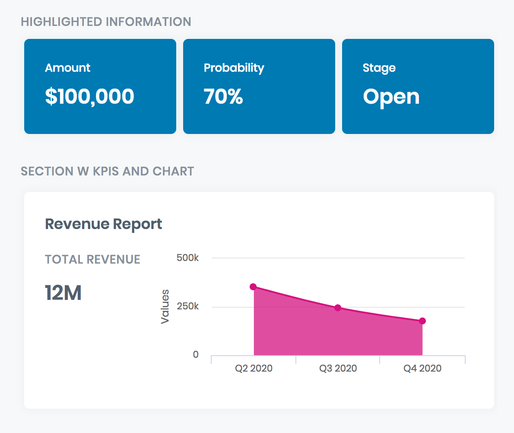
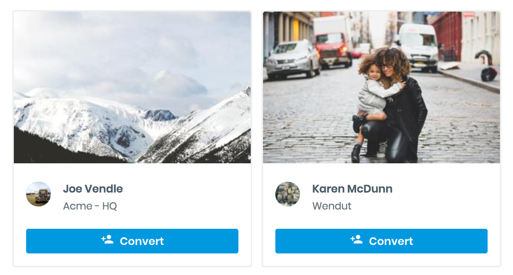
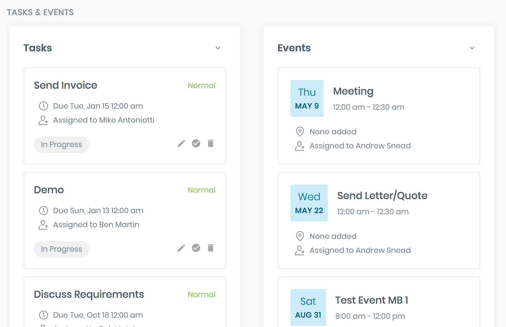
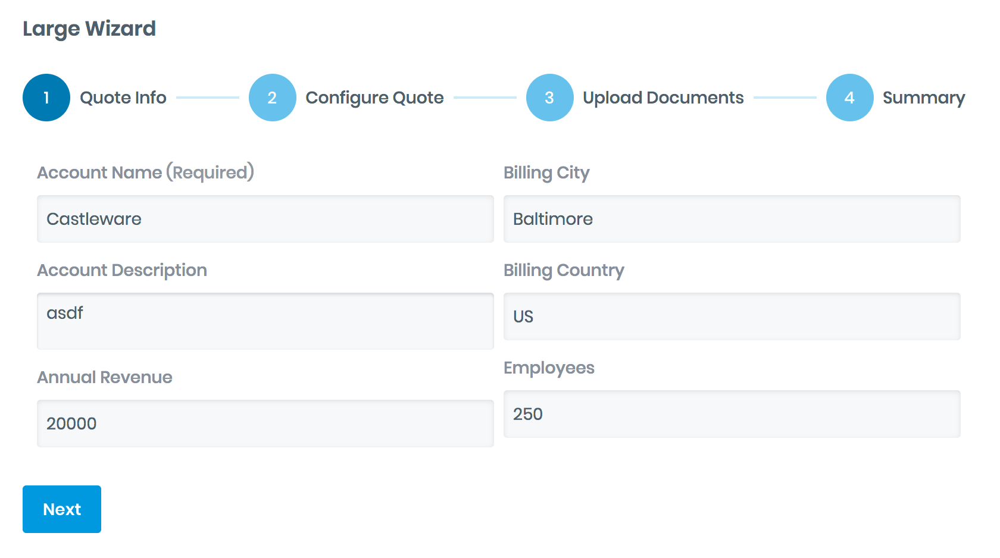

# Simple CRM

## Description
A design system customized to provide a consistent CRM user interface. 

## Preview
[Preview Simple CRM design system](https://portal.skuidsite.com/designsystems/simple-crm)

## Example Screenshots
#### KPI dashboard

#### Card

#### Task & Event Lists

#### Wizard

## Features
- Customization to support CRM functionalities: empty state, step-by-step wizard, KPIs, chart. 
- Demo page can be used as a style guide page to document and communicate with other app builders on how to use the design system consistently.

## Usage
- API: v2
- Design System: Download [Simple CRM Design System](SimpleCRM.designsystem?raw=true) and import it to Skuid's Design Systems.
- Demo page: Download the [Demo Page](SimpleCRM_DesignSystem_DemoPage.xml?raw=true). In Skuid, create a new page and select Import XML file to import this demo page.

## Notes
- For usage in Salesforce, this design system works for version [Spark Update 3](https://docs.skuid.com/v12.4.2/v2/en/release-notes.html) or higher. Older versions of Skuid can result in styling losses.
- The Demo Page uses standard Salesforce objects (Accounts, Contacts, Opportunities, Tasks, Leads).

