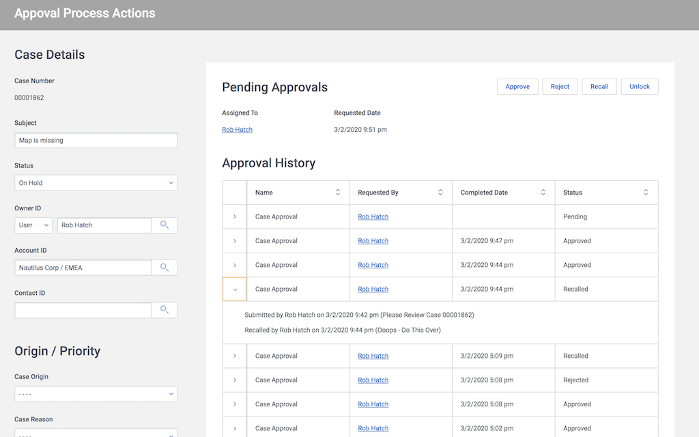

# Salesforce Approval Processes

Salesforce approval processes allow for very complicated workflows and multi-party transactions to be managed and tracked effectively. It's a powerful platform. Often Skuid builders want to expose approval history for a particular record and enable the relevant approval actions to facilitate these workflows.

This sample page shows both of these in action. A chain of models is used to show approval history for a particular record along with the details about this approval. Salesforce data source actions enable the various approval actions. 

</img>

## Instructions
- Page API:  V2
- Data source: Uses default Salesforce data source
- Design system: None 
- Page XML:  [Copy the XML from this page](ApprovalProcessActions.xml), or save it as an XML file, and upload it as a new page in your Salesforce Org.  

## Notes
- Before this page can run - an approval process must be created on the Case object. 

- In order to use the "Unlock" action the following Salesforce setting you must to go to `Salesforce  Setup->Create-> Workflows and Approvals -> Process Automation Settings` and set checkbox `Enable record locking and unlocking in Apex` as true.

- Explore the render conditions on the approval actions to see how the appropriate action is shown for the record context. For example: 
    - If a record has not been submitted, only show the "submit for approval" action.  
    - If an approval is pending, only show the approve / reject buttons to the eligible approver.  

- Explore the message area - a component that is initially hidden, but is triggered to be exposed if there are errors in the Salesforce approval actions.

## Related Links
- [Salesforce Developer Docs](https://developer.salesforce.com/docs/atlas.en-us.api.meta/api/sforce_api_erd_process.htm) 
- [Skuid Documentation](https://docs.skuid.com/latest/en/data/salesforce/#approval-process-actions)
- [Internal link in Demo Org](https://skuid-demo--skuid.na37.visual.force.com/apex/skuid__ui?page=ApprovalProcessActions&id=500U0000004ieGnIAI) (for Skuid Employees only)

<!--
Rnh Notes. 

Approval and Reject actions:  If you immediately requery the approval process models,  the APEX required to perform the actions may not have completed.  Bug with components not listening to requery changes. 

I don't yet understand Lock and Unlock of parent record,  and how I can see this?  Do we have a way of controlling the interface if a record is locked?  Can we conditionally enable?

Message block - Don't use conditional rendering via field values,  use component actions to show message block.   There is still a problem with message block not merging {{$CurrentAction.error}} 
-->