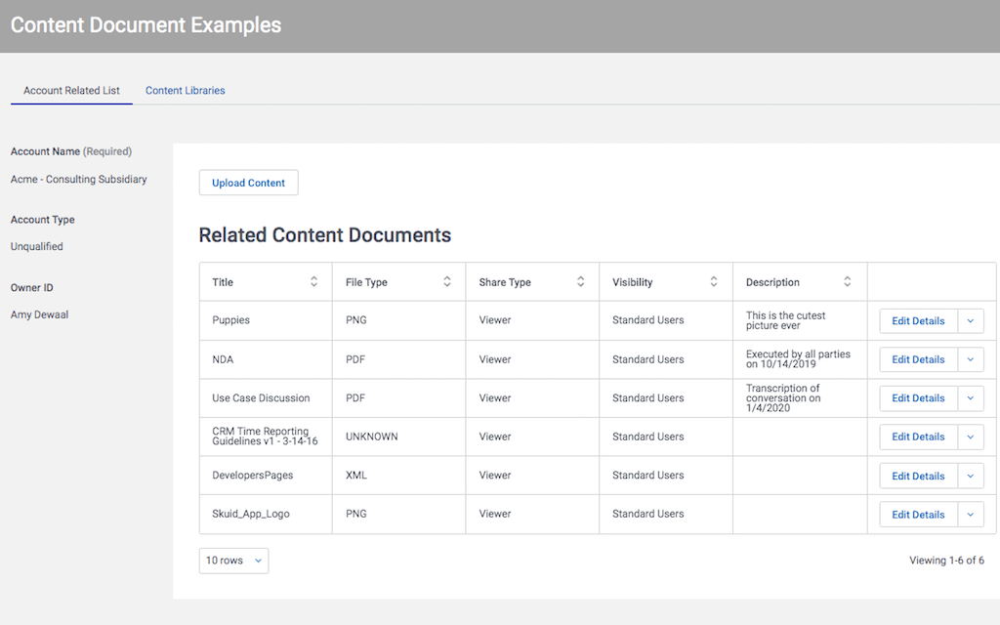

# Salesforce Content in Skuid

Salesforce has deprecated the simple attachments object in favor of a more feature-rich "content" structure. While there is lots of exciting new functionality in the new structure, it is more complicated to implement in Skuid. 

This sample page shows two sample implementations of the content document structure. 
- Provide documents related  to a single parent record (like an account or opportunity).  
- Create a stand alone document library with a folder structure of workspaces. 

In each case functionality is provided to preview, download, edit metadata and review the revision history of particular content documents. 

</img>

## Instructions
- Page API:  V2
- Data source: Uses default Salesforce data source
- Design system: None 
- Page XML:  [Copy the XML from this page](ContentDocumentExamples.xml?raw=true), or save it as an XML file, and upload it as a new page in your Salesforce Org.  

## Related Links
- [Salesforce Developer Documentation](https://developer.salesforce.com/docs/atlas.en-us.api.meta/api/sforce_api_erd_content.htm)
- [Skuid Documentation - File Upload Component](https://docs.skuid.com/latest/en/skuid/components/original/file-upload/#using-the-file-upload-component)
- [Skuid Community](https://community.skuid.com/t/file-upload-to-salesforce-files-instead-of-attachment/6748)
- [Internal link in Demo Org](https://skuid-demo--skuid.na37.visual.force.com/apex/skuid__ui?page=ContentDocumentExamples&id=0010P00001x1jtoQAA) (for Skuid Employees only)

<!--
Rnh Notes. 

Some Context related conditional rendering problems with second documents table in deck of workspaces. 
-->
