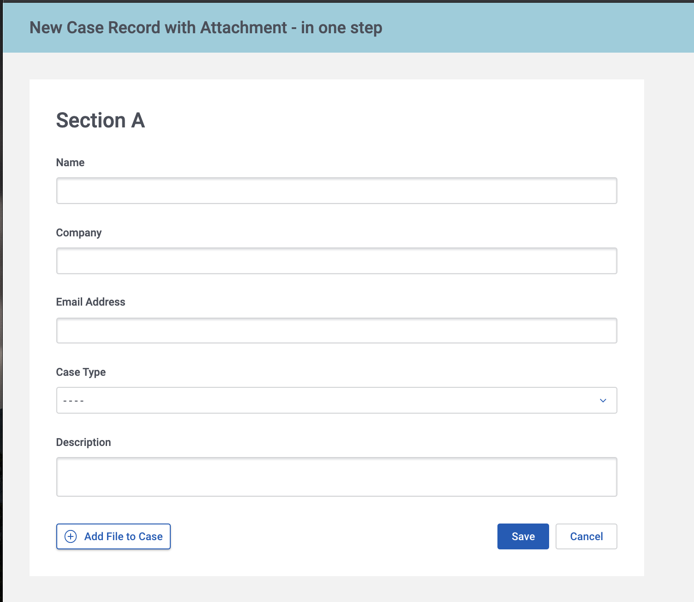

# Create New Record and File in One Step. 

Salesforce content documents and attachments have to be connected to **existing records.** This means that you cannot create a new record and upload a file for that record in the same UI step. 

Typically Skuid builders have used a 2 step wizard to handle this, with step one being data entry for a new record, then forcing the user to save that record before they can upload a file or image to it in step two. This is functional, but not optimal. 

This sample page shows how to create a case and upload a file to that case in the same step. Though this method seems like a bit of hack, it's actually used behind the scenes by Salesforce in some of their standard UI. 

The process is as follows. 
- File is initially uploaded as a content document linked to the `current user` record. (Everyone has a saved user record.) 
- After the new record metadata is completed the save button does the following: 
    - Saves the new record. 
    - Creates a new `content link` record connecting the file to the new record that has now been saved. 
    - Saves the content link record. 

Curiously there is always a content document link record created to the user record. You can't delete it. 

We also include some JavaScript and an action sequence that deletes the uploaded file if the page is abandoned before the new record is saved.  This keeps things clean. 

</img>

## Instructions
- Page API:  V2
- Data source: Uses default Salesforce data source
- Design system: None 
- Page XML:  [Copy the XML from this page](CreateRecordAndFile.xml), or save it as an XML file, and upload it as a new page in your Salesforce Org.  

## Related Links
- [Skuid Documentation - File Upload Component](https://docs.skuid.com/latest/en/skuid/components/original/file-upload/#using-the-file-upload-component)
- [Skuid Community](https://community.skuid.com/discussion/8015548/solutions-for-uploading-a-file-to-a-new-record#latest)
- [Salesforce Stack Exchange](https://salesforce.stackexchange.com/questions/274499/unable-to-delete-contentdocumentlink)
- [Internal link in Demo Org](https://skuid-demo--skuid.na137.visual.force.com/apex/skuid__ui?page=OneStepNewRecordAndFile) (for Skuid Employees only)
