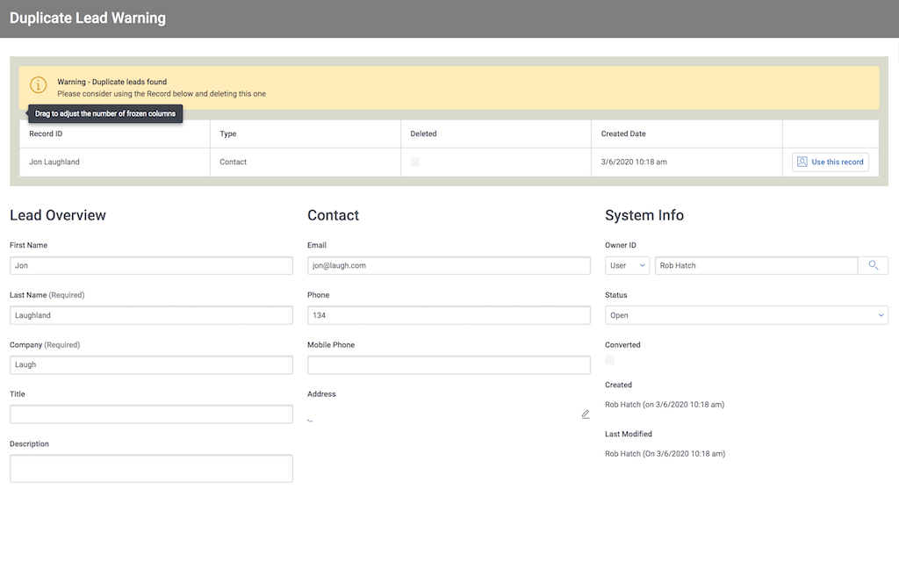
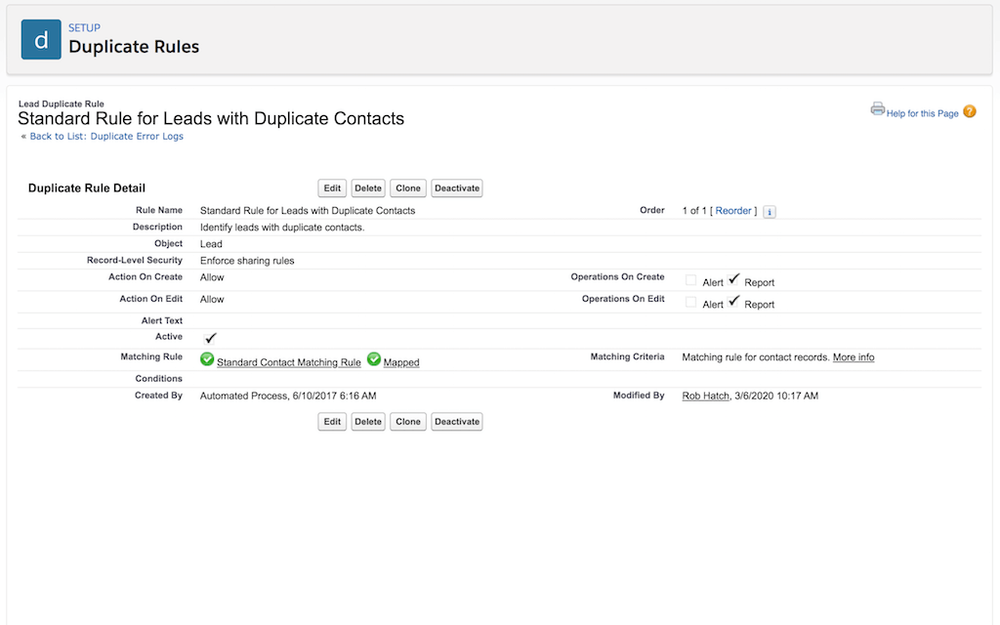

# Salesforce Duplicate Management in Skuid

Salesforce provides tools for ensuring data quality and preventing duplicate records.  The Duplicate Management tools provide highly configurable ways to test for duplicates as records are created and then prevent the duplicate creation or provide suggestions about the records that should be used. Set this up in `Salesforce Setup --> Data --> Duplicate Management`

Skuid currently does not support the rules that prevent records from being created or warn users on new duplicate creation.  If the warning is shown to the user the save action cannot be completed and we cannot show the "suggested records" that should be used instead of the new duplicate. 

Skuid does support use of the duplicate report.   The example below is a Lead detail page that warns the user that a contact is most likely a duplicate of the lead currently being reviewed. 

</img>

## Instructions

This example leverages the standard duplicate rule "Standard Rule for Leads with Duplicate Contacts". This rule must be active in your org,  and the "Alert" operation on Create must be turned off.  See the screen-shot below of the rule 

</img>

- Page API:  V2
- Data source: Uses default Salesforce data source
- Design system: None 
- Page XML:  [Copy the XML from this page](DuplicateLeadWarning.xml), or save it as an XML file, and upload it as a new page in your Salesforce Org.  

To see this page in action,  find a lead that matches a contact's name and email address.  Then Preview the page using that lead.

## Notes
- This page uses 2 models on the DuplicateRecordItem sObject, which provide data for the duplicate management report. 

- If there are records in these models conditional rendering is used to expose a message block and table that shows the duplicate warning and encourage the user to delete the current lead record and redirect to the suggested contact.  

## Related Links
- [Skuid Community](https://community.skuid.com/skuid/topics/duplicate-management-in-winter-15?topic-reply-list%5Bsettings%5D%5Bfilter_by%5D=all)
- [Internal link in Demo Org](https://skuid-demo--skuid.na37.visual.force.com/apex/skuid__PageBuilder?id=a090P00001ncweeQAA) (for Skuid Employees only)

<!--
Rnh Notes. 
Maybe expand this to discuss options for interacting with list of duplicate leads  (Requires new dupe management on lead to lead)

When field actions are possible, you could update lead values with what is in duplicate item. 
-->