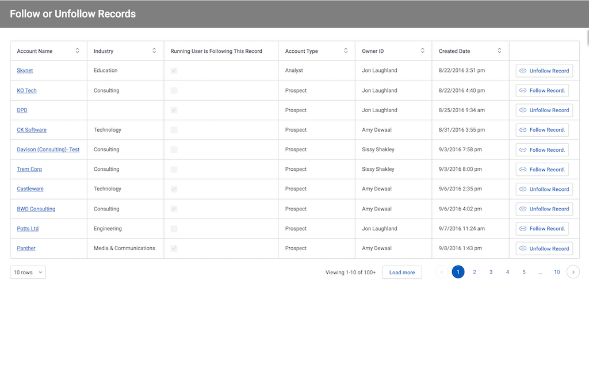

# Follow and Unfollow Records in Chatter

While its not talked about too much, Chatter is a powerful way to let teams collaborate. A feature that makes it superior to Slack or other external tools,  is that users can chose to follow individual records, and then stay notified about activity and conversation related to those records. It is really powerful to create a conversation around a particular account or case, etc. 

Skuid pages can be configured to include this process.  The example below shows how to follow and un-follow particular account records.  The concepts in this page can be applied to record detail pages,  or list pages (using row actions).

</img>

## Instructions
- Page API:  V2
- Data source: Uses default Salesforce data source
- Design system: None 
- Page XML:  [Copy the XML from this page](FollowRecords.xml), or save it as an XML file, and upload it as a new page in your Salesforce Org.  

## Notes
- Chatter must be turned on in the org for this to function correctly. 

- Remember that a single user can only follow 500 records.  A Skuid page that uses an aggregate model counting entity subscription records by user may be helpful to see if anyone is in trouble. 

## Related Links
- [Salesforce Developer Docs](hhttps://developer.salesforce.com/docs/atlas.en-us.api.meta/api/sforce_api_objects_entitysubscription.htm) 
- [Internal link in Demo Org](https://skuid-demo--skuid.na37.visual.force.com/apex/skuid__ui?page=Follow_Records) (for Skuid Employees only)