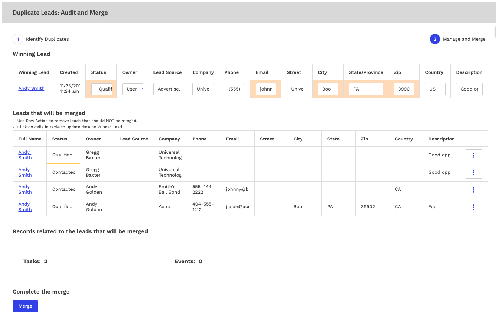

# Merging Duplicate Records

This sample page shows an example of auditing lead records for duplicates. This includes the following detailed functions: 

- Identify possible duplicate records.
- Review those records to exclude the ones that are legitimately duplicates. 
- Update the “winner” record with the best field values from among all the duplicates identified. 
- Identify the related records that look up to the duplicate records, and re-parent them to the “winner” record.
- Remove all the duplicate leads and update the winner! 

</img>

This example is described in more detail in a [blog post at Skuid Word](https://www.skuid.com/blog). Specific techniques and tools are described there. 

## Instructions
- Page API:  V2
- Data source: Uses default Salesforce data source
- Design system: None 
- Page XML:  [Copy the XML from this page](LeadDedupe.xml), or save it as an XML file, and upload it as a new page in your Salesforce Org.  

## Related Links
- [Internal link in Demo Org](https://skuid-demo--skuid.na137.visual.force.com/apex/skuid__PageBuilder?id=a094U00001qVMa1QAG) (for Skuid Employees only)