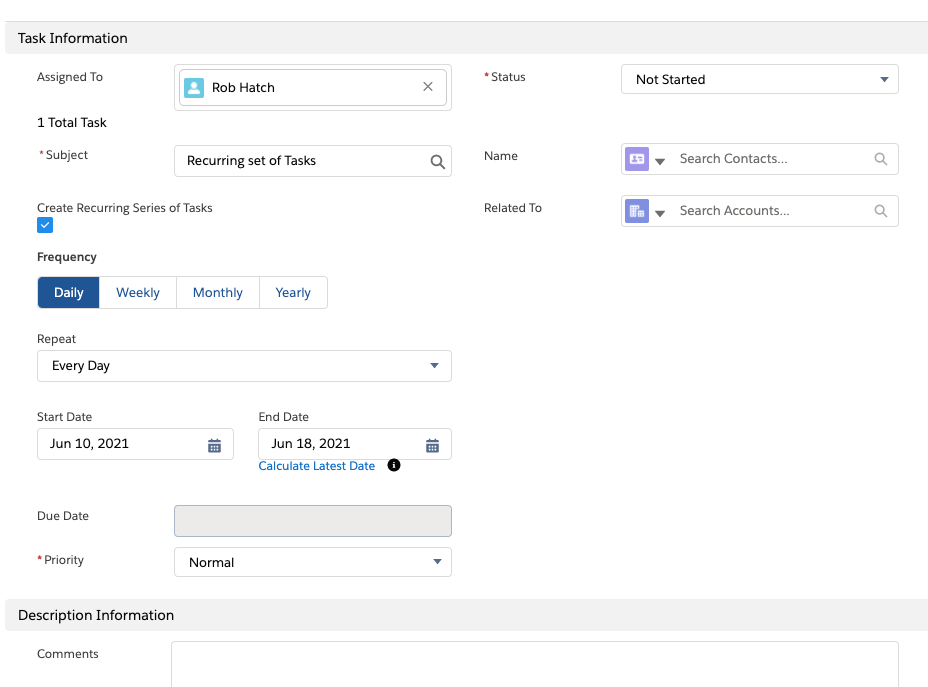
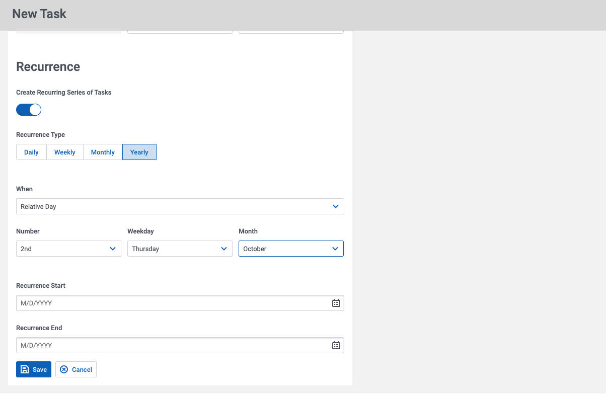

# Replicating Recurring Tasks and Events in Skuid

Salesforce allows users to set up recurring tasks and events, which are a series of records following some recurrence pattern. The standard layout provided in Lightning does a lot of “conditional rendering” and “custom field displays” to facilitate the definition of recurrence. Below we'll break down how this functionality works in Salesforce and then describe how to replicate it in a Skuid page.

## How recurring tasks work in Salesforce 

</img>

In order to use this functionality you need to turn on **Activity Recurrence** in Setup (Look for Activity Settings ensure the option “Enable Creation of Recurring Tasks” is on.) 

This feature enables about 12 new fields on the Task object that all have “Recurrence” in their API titles. Understanding this data model is essential to replicating it in Skuid. 

### Overview
1. When creating a new task, there is a checkbox for “Create Recurring Series of Tasks” (`IsRecurrence` boolean field) Once this is checked a new section of the interface appears. 

2. Next, the frequency of recurrence is chosen. (Daily, weekly, etc). This updates the `RecurrenceType` picklist field. Depending on this selection - a series of other questions are exposed. 

3. All the types have a “start and end” date. These fields are `RecurrenceStartDateOnly` and `RecurrenceEndDateOnly`. There does not appear to be a way to “create 10 recurrences” without choosing an end date. 

### Fields shown based on Frequency. 

**If Type = Daily, then show:** 
- Interval ( `RecurrenceInterval` integer field) 

Note: Salesforce adds a picklist for common intervals. (single, every other, and custom). Only when custom is selected is the true dropdown exposed with all the numbers. This is only present in the UI and is translated to an appropriate integer value in the Interval field. 

**If Type = Weekly, then show:**
- Interval
- Weekdays when task occurs (`RecurrenceDayOfWeekMask` integer field)

Note: The Day of Week field is both strange and amazing. The field is stored as a single integer, but uses a bit mask to transform that integer into a set of distinct work days. 

Each workday is represented as a specific number: 
- Sunday = 1
- Monday = 2
- Tuesday = 4
- Wednesday = 8
- Thursday = 16
- Friday = 32
- Saturday = 64

Multiple days are represented as the sum of the numerical values. For example, Tuesday and Thursday = 4 + 16 = 20. 

**If Type = Monthly, then show:**
- Interval
- Choice between specific day of month (5th day) or relative day (Last Tuesday). 

    - If “Specific,” then show the `RecurrenceDayofMonth` field (an integer)
    - If “Relative,” then show the `RecurrenceInstance` picklist field (1st, 2nd … Last) and the day of week field described above. 

Note: This choice between specific and relative is presented as a separate field, but does not exist in the data model. It controls the `RecurrenceType` value between `RecursMonthly` and `RecursMonthlyNth`.

**If Type = Yearly, then show:**

- Similar choice between specific and relative. 

    - If “Specific”, no other fields are needed. The start date is repeated every year through the end date. 
    - If “Relative” - then show Recurrence Instance, and Weekday Selection, from the Monthly type. Also show a Month of year picklist field (`RecurrenceMonthOfYear`) This enables the selection of “First Tuesday in November” 

### Server Side Activity 
When you save a task with a recurrence pattern, Salesforce creates a set of tasks that look up to the master task you created using the RecurrenceActivityId field. 
 
Salesforce also keeps the tasks in sync as changes are made to recurrence or to end dates. If you extend the end date of the recurrence pattern, more records will be added after saving. You can also change individual tasks without affecting the recurrence. 

## How a Skuid page replicates this UX

</img>

Skuid’s capabilities for conditional rendering and customized field display enable a very close replication of the sophisticated Salesforce Lightning UI for defining recurrence on a new task and editing recurrence on an existing task. The flexible data model, and server side processing, also enable Skuid builders to simplify defining recurring task definition, and easily show groups of recurring tasks. 

See sample page that shows this working. 

### Create New Task Page

- Page API: V2
- Data source: Uses default Salesforce data source. (Note that Activity Recurrence must be turned on in the org) 
- Design system: None
- Page XML:  [Copy the XML from this page](CreateRecurringTask.xml?raw=true), or save it as an XML file, and upload it as a new page in your Salesforce Org.

#### Overview
There are four core concepts driving this page you will want to explore. 

1. **Conditional Rendering**. There are sections in the form for each main recurrence type. These are conditionally rendered based on the recurrence type field. In each section there are also individual fields that are only shown based on other data conditions. All the scenarios described above (If value X show fields Y and Z) are replicated this way. 

2. **Metadata Overrides**. A number of fields can be presented in a more pleasing UX by overriding their metadata. Examples include: Integer fields being presented as Picklists. Picklist values being limited and presented with better labels. See details below. 

3. **UI-Only Fields**. As described above, there are some selections made that don’t correspond with fields. These can be replicated in Skuid with UI-only fields. 

4. **Action Sequences**. In a number of places UI-only field changes trigger updates to database fields. These are done with actions sequences triggered by model changes (look for these actions in the model configuration) or triggered when the task is saved (look at the save button). 

#### Field details 


- **Recurrence Type**. The Skuid solution uses a Metadata override on this field to do the following: 
    - Change these labels so they are better in the UI. (You can’t change these labels in SF). Make sure to use the right values in your override. See the default metadata below. 
    - Remove the 2 “Nth” values so there are not two Monthly or Yearly options. The correct values are populated in actions triggered by the save button. (See “Specific days and relative days” below)

```
Field Metadata. 
value: "RecursDaily", label: "Recurs Daily"
value: "RecursEveryWeekday", label: "Recurs Every Weekday"
value: "RecursMonthly", label: "Recurs Monthly"
value: "RecursMonthlyNth", label: "Recurs Monthly Nth"
value: "RecursWeekly", label: "Recurs Weekly"
value: "RecursYearly", label: "Recurs Yearly"
value: "RecursYearlyNth", label: "Recurs Yearly Nth"
```

- **Recurrence Day of Month** and **Recurrence Intervals**. These fields are stored as numbers. The Skuid solution overrides the metadata so they are picklists, providing a better experience in the UI and better control over possible complexity. 

- **Recurrence Interval**. The custom picklist for common intervals (single, every other, and custom) is replicated in Skuid with a UI-only picklist field. Look for RecurrenceIntervalDisplay in the New Task model. Model actions populate the real Interval field whenever the UI-only field is updated. 

- **Day of Week**. A completely declarative solution for this strange and wonderful field is to use a UI-only multi-picklist field to capture the days of the week when the recurrence should occur. The “Multi-button group” display method for this field makes it look very similar to the Salesforce standard layout. Then the standard `RecurrenceDayOfWeekMask`  field metadata is overridden to convert it to this formula:   

```
IF(CONTAINS({{RecurrenceDayDisplay}}, 'Sunday'),1,0) + 
IF(CONTAINS({{RecurrenceDayDisplay}}, 'Monday'),2,0) + 
IF(CONTAINS({{RecurrenceDayDisplay}}, 'Tuesday'),4,0) + 
IF(CONTAINS({{RecurrenceDayDisplay}}, 'Wednesday'),8,0) + 
IF(CONTAINS({{RecurrenceDayDisplay}}, 'Thursday'),16,0) + 
IF(CONTAINS({{RecurrenceDayDisplay}}, 'Friday'),32,0) + 
IF(CONTAINS({{RecurrenceDayDisplay}}, 'Saturday'),64,0)
```

    This adds the right value to the integer field based on the presence of the specific day in the multi picklist field.  

    Note:   When you choose formula as the metadata type,  Skuid thinks this field is now read only.  But in this case - you do want to write this value back to the server.  You have to go to the XML to change the “read only” property on the field to “false” 

    See more information below on reading the integer field and converting it back to days of the week.  That is fun too. 

- **Specific days and Relative days**. A UI-only picklist field enables this selection and is used to control the conditional display of other fields. Action sequences on task save change the Recurrence type based on this selection (and the Recurrence Type).

#### Advanced Suggestions

Some final touches could be delivered in code. We’ve not done these in the solution, but have sketched out ideas here. 


- **Interval Display UI-only field**. Because this field is used for daily, weekly, and monthly recurrence patterns, it would be nice for the picklist labels to be dynamic -- like “every day” or “every week” based on recurrence type. This could be done with a snippet. The values will stay the same. This could be done with separate UI only fields for each recurrence type - but that would require extra complexity in the Model Actions, bah. 

- **RecurrenceEndDateOnly**. The Salesforce UI has a “max date calculator”. Because they only allow 100 recurrences, this feature takes the recurrence pattern, calculates 100 entries, and populates the corresponding date. This would take some custom code to retrieve. 

### Bonus: Review / Edit Existing Tasks
A second page provides an initial example for managing existing tasks. This includes collecting all recurring instances under a parent task. 


- Page API: V2
- Data source: Uses default Salesforce data source. (Note that Activity Recurrence must be turned on in the org) 
- Design system: None
- Page XML: [Copy the XML from this page](TaskListWithRecurrence.xml?raw=true), or save it as an XML file, and upload it as a new page in your Salesforce Org.

#### Notes about the page: 

- A filter on the Task List removes shows or hides recurring tasks. Look at the conditions the filter uses. 


- The “New Task” button uses a Page Include calling the page described above. If you have changed the page name to anything other than “CreateRecurringTasks” you will need to update the Page Include in the modal behind that New Task button. 


- The Details button exposes information about specific tasks, and uses conditional rendering to show the recurrence pattern information, and a table of the related recurring tasks. 


- The table of related recurring tasks is a second model that uses a condition on the RecurrenceActivityId field. 
 
#### Field Details: 

**Day of Week**.  `RecurrenceDayOfWeekMask`  is stored as an integer. To display that as a series of weekdays in a multi-picklist display field, we have to figure out what combination of 1,2,4,8,16,32, and 64 is in the integer. The binary equivalent of the integer is more easily translatable to the week format, so we convert the integer to binary and use that binary string to figure out what values to update in the multi-picklist display field. 

In the example page the TaskDetail model has 5 extra UI-only fields with the “Weekday” prefix. These are used in an action sequence titled “Convert To Binary” that recursively pulls the integer apart, creates the binary value, translates that into a string of weekdays and then populates that back into the multi-picklist field. 

Also there is an action sequence that updates the  RecurrenceDayOfWeekMask with appropriate values any time the weekday multi-picklist field is updated.  


## Helpful links 

- [Setting up recurrence in Salesforce Admin](https://help.salesforce.com/articleView?id=sf.tasks_enable_recurring_tasks_lex.htm&type=5)
- [Developer API Docs](https://developer.salesforce.com/docs/atlas.en-us.api.meta/api/sforce_api_objects_task.htm)