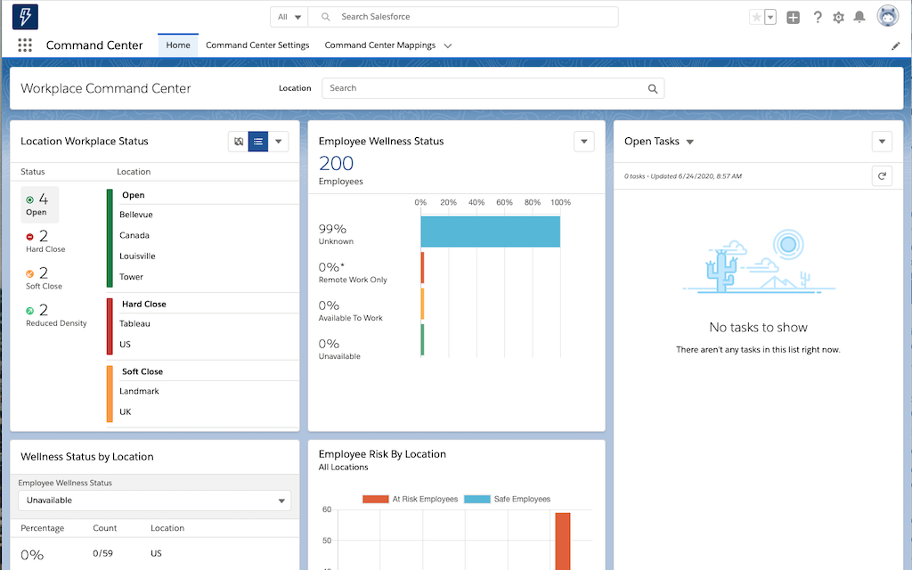
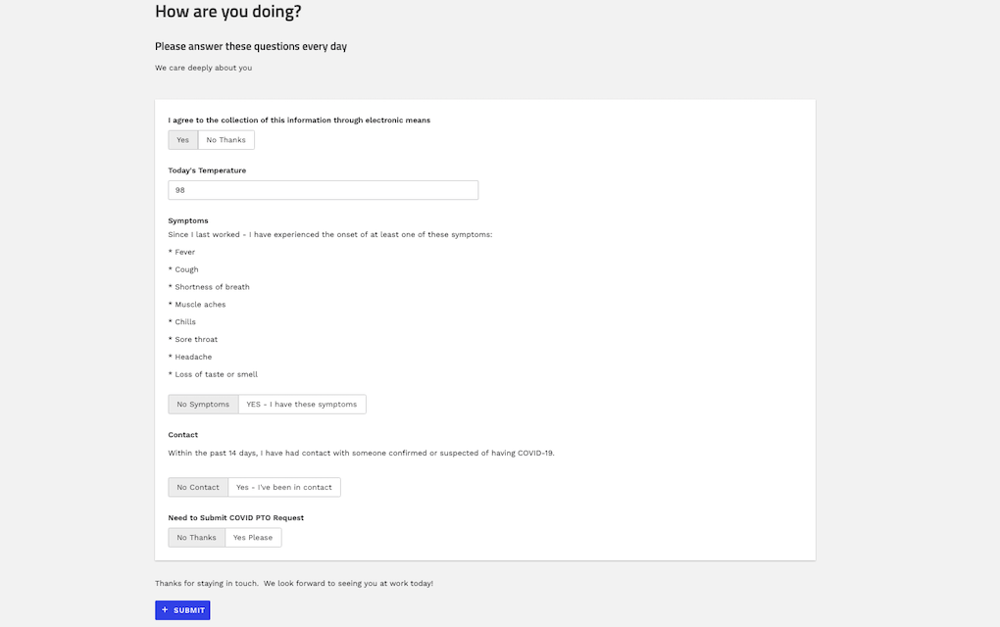

# Work.com Command Center

Salesforce has responded to the Covid-19 crisis by adding a significant amount of functionality to the Work.com offering.  The Workplace Command Center they quickly rolled out presents a very interesting set of capabilities and starting points for developing effective tools for employers who are managing a crisis of this nature. It helps employers answer these questions: 

- Are all my employment locations available to be opened? 
- Are my employees at risk?  Have they been exposed?  Are they presenting symptoms?  Should they come to work today? 
- Have my facilities received the necessary cleaning to mitigate risk of infection there? 

As should be expected,  Skuid works really well with the new sObjects and relationships that have been rolled out in this solution.  We'd venture that Skuid is the perfect tool for adapting the Work.com Command Center offering to the real-world needs of your company. 

This page will host a number of Skuid extensions to the Work.com solution. 

</img>

## Watch this in action. 
We did a webinar showing off this material.  [Watch it here.](https://www.youtube.com/watch?v=6H3k2xOgTpk&t=4s)

## Getting Started. 
### 1. Install Work.com command center  
The easiest way to get started exploring the Work.com solution is to install this in a scratch org using SFDX.  This means you will need to use your terminal and have git and SFDX installed.  [Read these instructions on installing SFDX](https://trailhead.salesforce.com/en/content/learn/modules/sfdx_app_dev/sfdx_app_dev_setup_dx#Tdxn4tBK-heading7)

Then follow these instructions: 
- Clone a local copy of the [WorkDotCom-Partners repo](https://github.com/forcedotcom/WorkDotCom-Partners) and then `cd` into its directory

 `git clone https://github.com/forcedotcom/WorkDotCom-Partners.git`

- Run the orgInit.sh file which will use SFDX to install all the necessary packages and metadata.   

`./orgInit.sh`

Now you can see the basic Work.com solution. 

More information: 
- [Help Pages.](https://help.salesforce.com/articleView?id=workdotcom.htm&type=5) Overview of the solution and additional installation options. 
- [Developer Docs.](https://developer.salesforce.com/docs/atlas.en-us.workdotcom_dev_guide.meta/workdotcom_dev_guide/wdc_cc_overview.htm) Additional configuration of this solution. 
- [Data Model.](https://developer.salesforce.com/docs/atlas.en-us.workdotcom_dev_guide.meta/workdotcom_dev_guide/wdc_cc_data_model.htm) Understanding the Data Model will be particularly important for any Skuid development. 

### 2.  Configure Consent Management. 
Parts of the Work.com solution are not automatically configured in step 1.  The critical one for the Skuid solution is consent management.  [Follow these steps.](https://help.salesforce.com/articleView?id=wcc_setup_configure_consent_management.htm&type=5) 

After creating the `Authorization Form Text` record, click into its detail screen. If you followed Salesforce's example, that means clicking `Wellness Authorization Text` in the  `Authorization Form Text` pane. 
Once you are on the Authorization Form Text detail screen, copy its  `ID` field for use in the Skuid page found below.   It is most easily viewed in the URL of the detail page.  It will be formatted similar to `0cN1700000003KiEAI`.
For example, in a URL  like `https://your-scratch-org-000.lightning.force.com/lightning/r/AuthorizationFormText/0cI3F0000008RM6UAM/view`, the ID would be `0cI3F0000008RM6UAM`.

### 3. Install Skuid
Get the latests version of Skuid installed in the new Scratch org.  Go to the [release page](https://Skuid.com/releases)

Since `orgInit.sh` assigned an alias to our scratch org, we can install Skuid v12.4.9 with this command: 
`sfdx force:package:install -p 04t4A000000YXnLQAW -w 30 -u WDCScratchOrg`

If you run the script again you'll get a new alias to avoid duplicates. These instructions assume you're working with the first instance with alias `WDCScratchOrg`

## Use Cases

## Employee Wellness Assessment

The first use case will be the form provided to employees every day before they come to work, asking "Are you ok?"  The Work.com solution uses the Salesforce Surveys feature.  This survey is sent every day by email - with a user specific link to a publicly available community page. 

With Skuid this form can be built in a host of other ways,  and deployed in many other places: 
- Salesforce Mobile App
- Employee Community
- Public force.com site
- Directly in a Salesforce.com web application. 

Skuid also allows for rich data entry experiences,  progressively answering questions,  and adjusting responses and outcomes based on the answers provided.  

We also imagined that employers might have additional reporting and data collection requirements that need to be integrated with this wellness survey.  We have a custom PTO request object in our org where we request time off.  Why not automatically create this PTO request with category `COVID-19` for any employee that needs to stay away from work because of their diagnosis. 

Finally - because it's Skuid, it can be beautiful. We used one of the [sample design systems](https://github.com/skuid/SamplePages/tree/master/Design_Systems) to  style our page.

</img>

### Instructions
- Page API:  V2
- Data source: Uses default Salesforce data source
- Additional sObject:  The PTO custom object can be deployed from this ZIP file. 
    - [Download this ZIP file](unpackaged.zip) to the directory where you are working on this solution. 
    - With your terminal in that same directory use this SFDX command:  
      `sfdx force:mdapi:deploy -u WDCScratchOrg -f unpackaged.zip -w -1`

- Design system: [Download this Design System file](https://github.com/skuid/SamplePages/blob/master/Design_Systems/Material/Material.designsystem), and use the Import function on the Design System page to add this system to your org.
    - You might also want to look at the [demo page](https://github.com/skuid/SamplePages/blob/master/Design_Systems/Material/Material_DesignSystem_DemoPage.xml) for that design system. 

- Page XML:  [Copy the XML from this page](WellnessForm.xml?raw=true), or save it as an XML file, and upload it as a new page in your Salesforce Org.  
    - IMPORTANT!  Before running this page you will need to find the `Consent` model,  open the Conditions,  look for `AuthorizationFormTextId` and replace the `ID` in its value with the one you copied in step 2 (Configure Consent Management) above. 

When you preview this page - it will ask you to select an `Individual`.  Make sure an Individual you select is connected to an `Employee`.   The Work.com install script should do this - but we've seen situations where it does not work.   

### Notes
- This page uses both the `Employee` and `Individual` sObjects to provide identity.  For testing, a condition on the `Individual` model uses a page parameter to retrieve the context of a single individual.  In production this would be changed so it was the associated with the running user. 

- This page uses a UI-only model to drive the survey - and then creates records in 3 objects based on the answer(`AuthorizationConsentForm`, `EmployeeCrisisAssessment`, and `PTO`). Look at the actions in the `SurveyQuestions` model to see how this works.  

- The form itself builds conditionally.  Look at the render conditions on each field in the form. 

- The final message, and the resulting Submit button, are rendered dynamically based on the answers provided.  Each Submit button executes a different sequence of actions. 

## Other Explorations Coming Soon
Stay tuned. 
