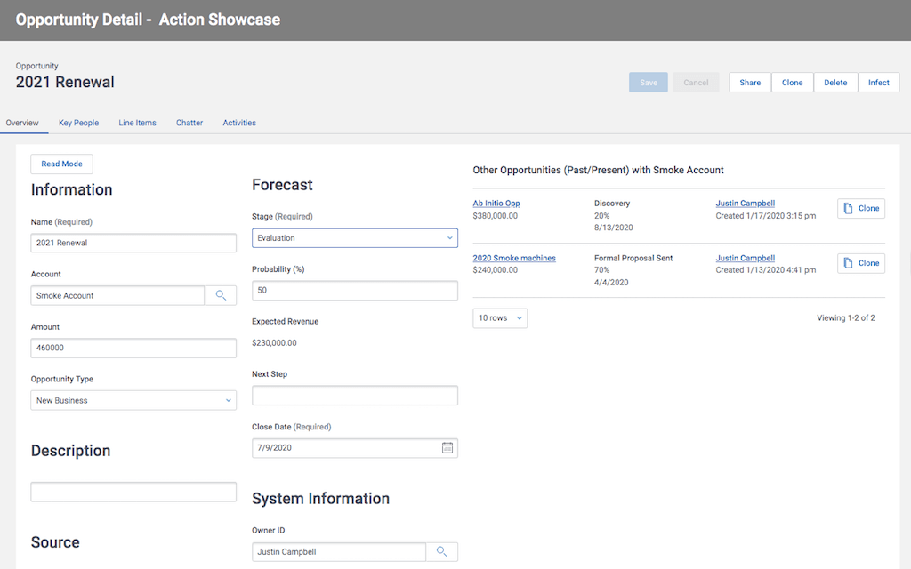

# Adaptive Logic: Examples of Actions

Skuid's Adaptive Logic provides robust mechanisms to inject interactivity and complex business logic into your pages without writing any code.  The extensive library of actions can be combined in many ways to perform really amazing functions.  These actions can be bound to a huge number of components and events within your page. 

This page shows a number of examples of the way Actions are used in typical Skuid page construction.  This example is by no means exhaustive, but just gives an idea of the art of the possible. 

</img>

## Instructions
- Page API:  V2
- Data source: Uses default Salesforce data source
- Design system: None 
- Page XML:  [Copy the XML from this page](Opportunity_Detail_Action_Showcase.xml), or save it as an XML file, and upload it as a new page in your Salesforce Org.  

## Notes

This page does not show absolutely every action,  but it shows a number of common scenarios. Here is an overview of what is included.

Header actions: 
- The most simple actions are behind the Save and Cancel buttons.  Where you determine the number of models to interact with,  and how to message success to your users. 
- The Delete button shows an example of modal configuration.  In this case asking the user to confirm they really want to delete the record.  The action on the button is very simple,  but inside the modal - look a the sequences on the Confirm button for more complex chain of actions that execute the delete and redirect the user. 
- The Four remaining buttons are "data source actions" specifically available to Salesforce.  This is how we connect with capabilities specific to a single data source.  Read about the actions available with[] each data source here.](https://docs.skuid.com/latest/v2/en/data/#data).   

Overview tab: 
- The basis display of opportunity data is best done in "Read Mode" .  But the component actions at the top of this page elegantly allow you to toggle the form into edit if changes are needed. 

Key People tab: 
- The "Define Key People" button is similar to the delete button above -- the complicated configuration is in the modal.  Look at the button on the contact table.  It creates new "Opportunity Contact Roles" with role data from the form above,  and with contact data from the table row.  Then it saves the new record.  One click task! 

Line items tab:
- Tables generally use a set of standard actions.  These actions used to be implemented by default,  but in V2 you have to explicitly configure them, we wanted builders to think through what features to provide and not have all these features on by default.  These actions include mass edit (Which is at the bottom of the list of actiosn), mark for delete,  edit row, etc. 
- The Clone row action is unique - it simply creates a new row in the line item model - and passes the values from the current row into it.  That simple action will make it show up in the table as a new row. 
- The Salesforce Product data model and validation framework is complicated.  But with some model actions, formula fields and reference field filters Skuid can manage the complexity with an elegant user experience.  Look at the `ProtoLineItem` model for a simple action that moves Unit price out of the price book entry record - into the opportunity line item - which allows for server side referential integrity checks to pass.  All this gets facilitated in the ui behind the "New Line Item" button. 

Chatter feed: 
- Actions can be triggered when a new chatter post is submitted.  In this case we are simply requerying the task model,  so that any tasks created through Chatter show in that tab of the detail page. 

Activities: 
- Task lists beg for efficiencies in data entry and mass data management. A few examples are shown here.
- A row actions and a mass actions mark tasks complete by updating the status value in the row, and saving the model. 
- Ease the documentation of tasks by having separate buttons for new task,  logged phone call,  voice mail etc.  Each of these different global actions call the same action sequence,  but pass different input values so the right pre-population of task data can occur.  New Tasks don't populate due date and set status to open.  Logging phone call sets due date to today and status to complete. 

## Related Links
- [Skuid Documentation](https://docs.skuid.com/latest/v2/en/skuid/action-framework/)
- [Internal link in Demo Org](https://skuid-demo--skuid.na37.visual.force.com/apex/skuid__PageBuilder?id=a090P00001nd4UlQAI) (for Skuid Employees only)

