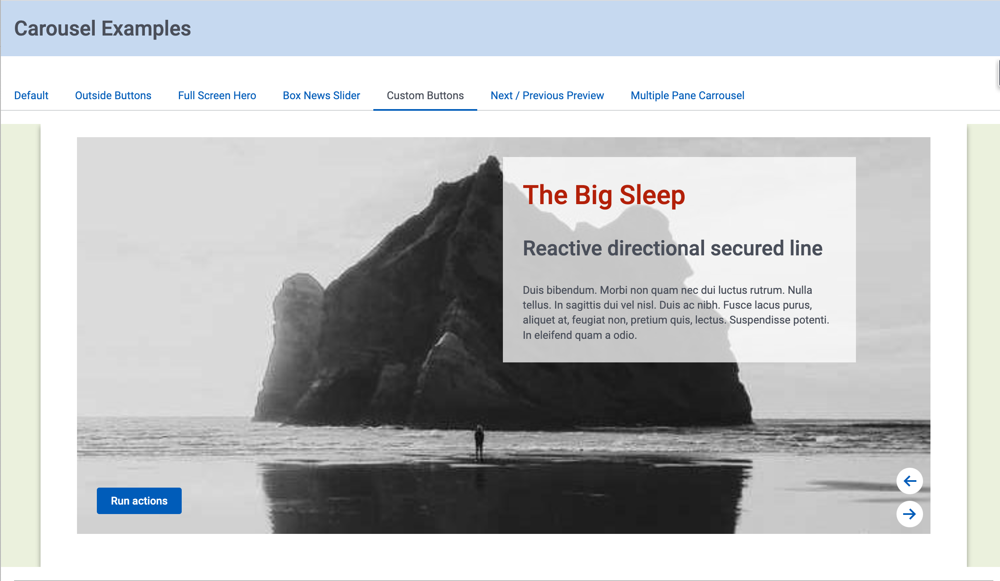

# Examples of using Skuid Carousel

Should you use a carousel?  Skuid asked this question for a long time. As we built more portal and community implementations, customers kept asking for this component. 

Your wish is our command.  Now Skuid has a carousel.

But how should you use it?  The page below has seven different implementations that achieve different design goals.  Full screen?  Small box for headlines?  Preview of next item?  All these are shown in this example page. 

</img>

## Instructions
- Page API:  V2
- Data source: Only UI-only models are used. 
- Design system:  [Download this Design System file](Carousel_Playground.designsystem?raw=true).  Use the Import function on the Design System page to add this system to your org.     
- Page XML:  [Copy the XML from this page](Carousel.xml?raw=true), or save it as an XML file, and upload it as a new page in your Salesforce org or Skuid NLX site.  

## Notes

 Each tab in the page has commentary about how it is constructed and any special considerations. 
