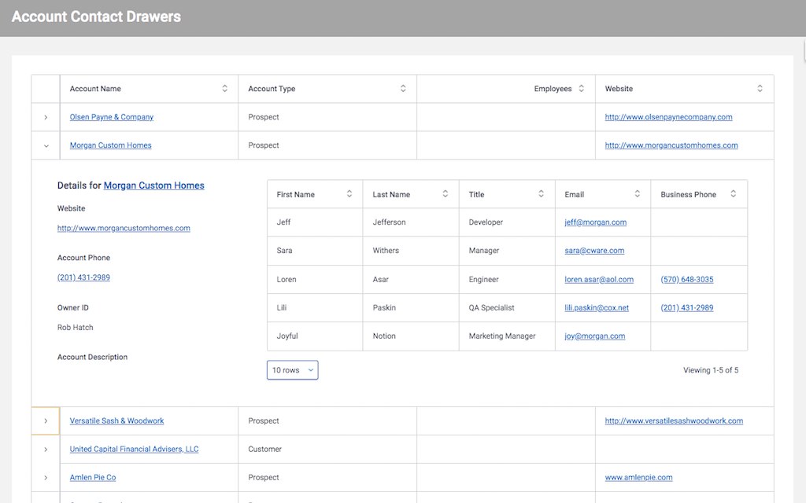

# Showing Child Related Data in Table Drawers

Skuid offers a number of ways of interacting with related data.  One powerful way is using table drawers. This allows a clean list of records presented in a table, as well as immediate access to additional details about the primary record, and any related information. In addition, you can open more than one drawer at a time. Unlike pop-ups or sliding detail panels, drawers let you compare details from more than one primary record. 

This page shows an account list, with a drawer that provides additional detail about the account - including a list of all related contacts for the account. Learn from this page and implement this technique in other Skuid pages.

</img>

## Instructions  
- Page API:  V2
- Data source: Uses default Salesforce data source
- Design system: None 
- Page XML:  [Copy the XML from this page](AccountChildrenTableDrawers.xml), or save it as an XML file, and upload it as a new page in your Salesforce Org.  

## Notes
Here are the key areas to be reviewed. 
-  Model properties: The contact model has a filterable condition. 
-  Table display properties: Drawers are enabled
-  Drawer icon:  Click icon on left of table to expose Drawer Properties. 
-  Before Load Actions: This sequence of actions only runs the first time the drawer is opened.  You don't need to query for ACME's contacts on the second time ACME's drawer is opened.  
-  Query Model Action: Note the "Gets more" property.  The contacts model will grow as the user interacts with different accounts. Component context is used to put the right contacts with the right account. 
-  Configure the Drawer to explore the components inside.  Each component has a "Context" property that instructs Skuid to only show the data relevant to that account. Look at this property on the table of contacts.

## Related Links

- [Tutorial in Skuid Documentation](https://docs.skuid.com/latest/v1/en/skuid/components/original/drawers/)  Note:  This tutorial uses V1 components,  but the concepts are all the same. 
- [Internal link in Demo Org](https://skuid-demo--skuid.na37.visual.force.com/apex/skuid__ui?page=Account_Children_Table_Drawers) (for Skuid Employees only)
