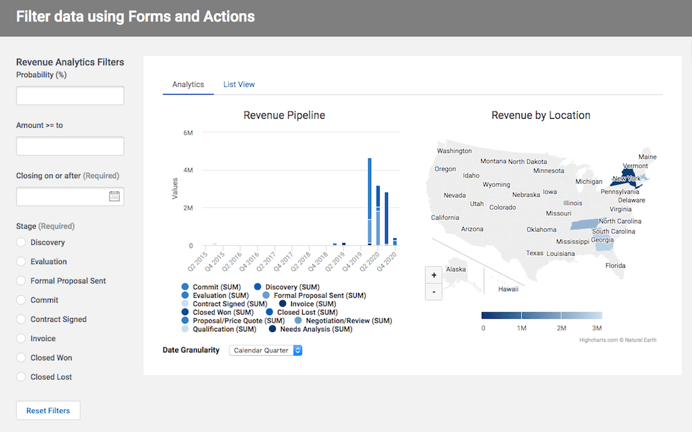

# Filtering data using forms and action sequences

While Skuid Filters on tables and in filter sets provide very flexible functionality - there are times when you want more.  This Skuid technique uses fields on one model,  with actions to pass values into conditions on a second model. 

</img>

## Instructions:  
- V2 Page API Used
- Data source: Uses default Salesforce data source
- Design system: None 
- Page XML:  [Copy the XML from this page](Arbitrary_Filters.xml), or save it as an XML file, and upload it as a new page in your Salesforce Org.  

## Notes:
- Look at the actions in the "Filters" model.  When changes are detected in those fields - the value is passed into a condition on the "Opportunities" model. 

- A branch on those actions handles "blank state"  IF the value is blank - the condition on the "Opportunities" model is deactivated. 

## Related Links: 
- [Internal link in Demo Org](https://skuid-demo--skuid.na37.visual.force.com/apex/skuid__ui?page=Arbitrary_Filters) (for Skuid Employees only)

