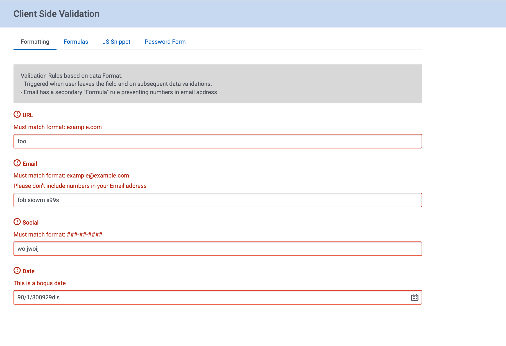

# Validate Form Data with Client Side Capabilities

Skuid can be used to create very effective and complex data entry forms.  Recently Skuid has added field validation features to its forms.  This allows you to provide feedback to users about data validity before they attempt a save. 

The example below shows a number of examples of this field validation in action.    

</img>

## Instructions
- Page API:  V2
- Data source: Only UI-only models are used. 
- Design system: None   
- Page XML:  [Copy the XML from this page](Validation.xml?raw=true), or save it as an XML file, and upload it as a new page in your Salesforce org or Skuid NLX site.  

## Notes

There are 4 tabs, each one showing a different model of validation.  Each tab has an explanation of the validation methods being used. 
