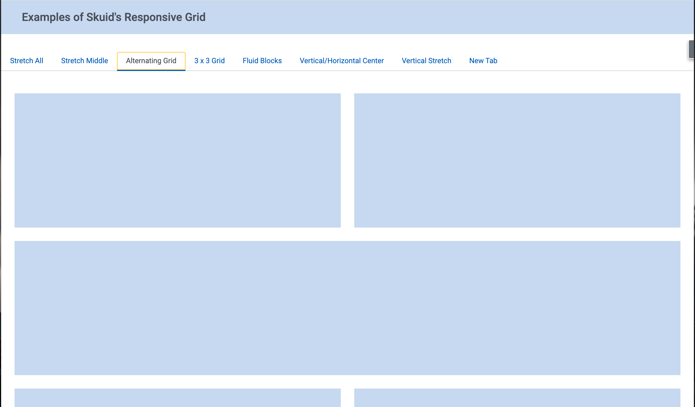

# Responsive Grid Examples

The Responsive Grid component is the primary way to arrange elements on a Skuid Page.   This Example page has 7 different examples of grid configuration - used to achieve effective layout results.  

</img>

## Instructions 
- Page API:  V2
- Data source: Only uses UI-Only Models
- Design system: None 
- Page XML:  [Copy the XML from this page](GridExamples.xml?raw=true), or save it as an XML file, and upload it as a new page in your Salesforce Org.  

## Notes
A key thought process: 

Providing space around information makes it much easier for your users to work with it - either reviewing that information or updating it in some way. A page that appropriately uses white space appears to breathe, and invites interaction rather than simply overwhelming with wall to wall data. Using the responsive grid as a standard part of your Skuid building habits will help your pages breathe.  

But the properties of the grid are a bit confusing to work with.  This page provides some examples.  Copy these properties into your own builds to achieve better results. 

Details below about each example in the page. 

### Stretch All
If you keep the `Flex Ratio` and `Minimum Width` property the same across all divisions - they will stretch evenly as your page grows. 

### Stretch Middle
If you give static divisions an equal `Minimum Width` and `Maximum Width` they will not grow with your page.  But the other content will. 

### Alternating Grid
Using percentages for width in your divisions allows the grids to move as page grows,  but also allows you to set some divisions to be full width while others are not. 

### Fluid Blocks
For a "Tiles" approach to content that has different heights,  Use multiple Decks - which also use the Responsive grid to arrange content. Dividing your data into multiple models that drive each decks may be interesting.  But there are strategies...

### Vertical / Horizontal Center
Look at the `Justify divisions` and `Align Divisions` properties on the grid to affect the way content is centered. 

### Vertical Stretch
The properties that control how tall an element is is not on the Division - but rather must be added to a Wrapper inside the division.  Look for Height and Scrolling properties for the two examples here.

## Related Links 

- [Internal link in Demo Org](https://skuid-demo--skuid.na37.visual.force.com/apex/skuid__ui?page=GridExamples) (for Skuid Employees only)