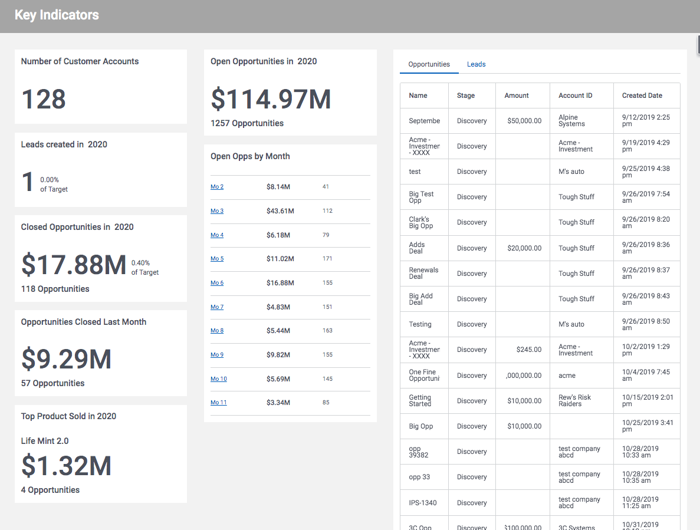

# Key Indicators Dashboard

The combination of dynamic data access and dynamic UI components makes Skuid a great solution for dashboards of all types. While charts are usually the star of a dashboard - there is great power in the display of single number - some KPI - that is used to track progress to some goal. This page shows a set of key indicators for Leads and Opportunities - and how to build these out.   

</img>

## Instructions 
- Page API:  V2
- Data source: Uses default Salesforce data source
- Design system: None 
- Page XML:  [Copy the XML from this page](KeyIndicators.xml), or save it as an XML file, and upload it as a new page in your Salesforce Org.  

## Notes
The key disciplines to a KPI block: 
- Use aggregate models to query a single number.   Total Leads YTD for example. 
- Use Wrappers and Grids to create a dashboard page structure 
- Use text component to show data, headers, supporting information, etc
- Use UI only models for calculated values.  In this example,  I also used a UI only model for populating "target" values - that are then compared to the actuals in a "calculations" model.  Those targets could come from a custom salesforce object,  or from another datasource.  (Airtable, SQL server)  The integration to determine the percent comlete happens in the page. 

## Related Links 
- [Skuid Learn - Visualization Journey](https://portal.skuidsite.com/learning/journeydetail/Visualization%20Basics)
- [Internal link in Demo Org](https://skuid-demo--skuid.na37.visual.force.com/apex/skuid__ui?page=KeyIndicators) (for Skuid Employees only)