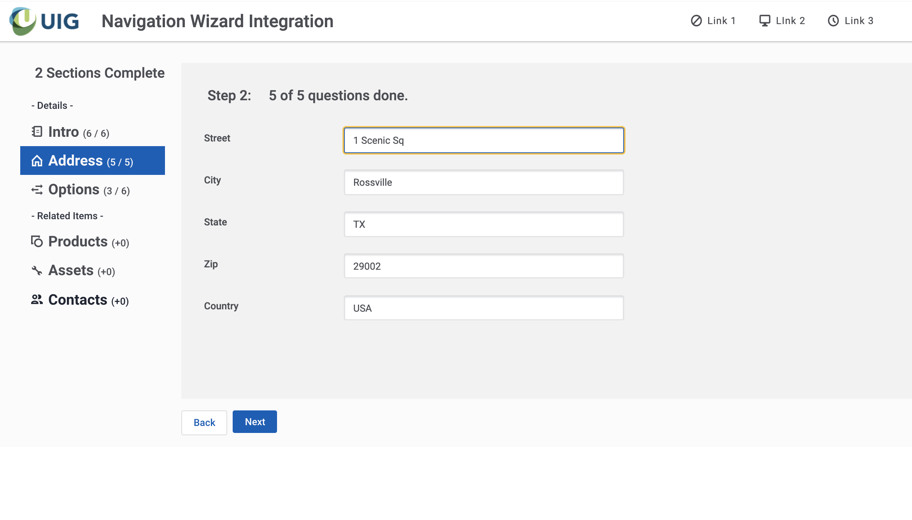

# Multi-part Form Navigation and Real-time Completion Status

Skuid can be used to create very effective and complex data entry forms.  There are two principles that can help users work through an extensive data entry process:  
- Break up the form into chunks.
- Provide wayfinding and progress status information. 

The example below uses the Wizard component to break up a form into several different sections, but also uses the Vertical Navigation component - with selected-state conditions - to provide more effective wayfinding and status information for the whole form.  The example shows how to integrate the Vertical Navigation items and the Wizard buttons so that both components stay in sync with user action. 

The example also shows how to include dynamic information within a navigation item.  This could be a counter of completed questions, or a completion icon, etc.    

</img>

## Instructions
- Page API:  V2
- Data source: Only UI-only models are used. 
- Design system: [Download this Design System file](SamplePages.designsystem?raw=true).  Use the Import function on the Design System page to add this system to your org.  
- Page XML:  [Copy the XML from this page](Multi_Part_Form.xml?raw=true), or save it as an XML file, and upload it as a new page in your Salesforce org or Skuid NLX site.  

## Notes

Syncing the Wizard and the Vertical Navigation selected state:

- A UI-only feld is used to manage selected state in the Vertical Navigation component.   (See the `NavPrimary` field in the `UI Control` Model).   All navigation items and Wizard buttons have action steps that update this field to an appropriate value. 
- The navigation items and the Wizard buttons each have a Wizard component action that moves the user to the correct step. 

Including dynamic information in navigation step: 

- The Vertical Navigation component will allow HTML in item labels.  This allows for formatting flexibility, as well as the inclusion of merge syntax to push model data into the label. 
- Because the component is not connected to a particular model this has to be global merge syntax, like `{{$Model.FormDetail.data.0.status1}}`.
- In order for the display within the navigation item to be updated when the data is updated you have to call a JavaScript snippet when the data is updated.  Look at the model action on the UI Control model (where the status fields are located),  as well as the JavaScript found on the page. 
 
## Related Links
- [Internal link in Demo Org](https://skuid-demo--skuid.na37.visual.force.com/apex/skuid__ui?page=Arbitrary_Filters) (for Skuid Employees only)
