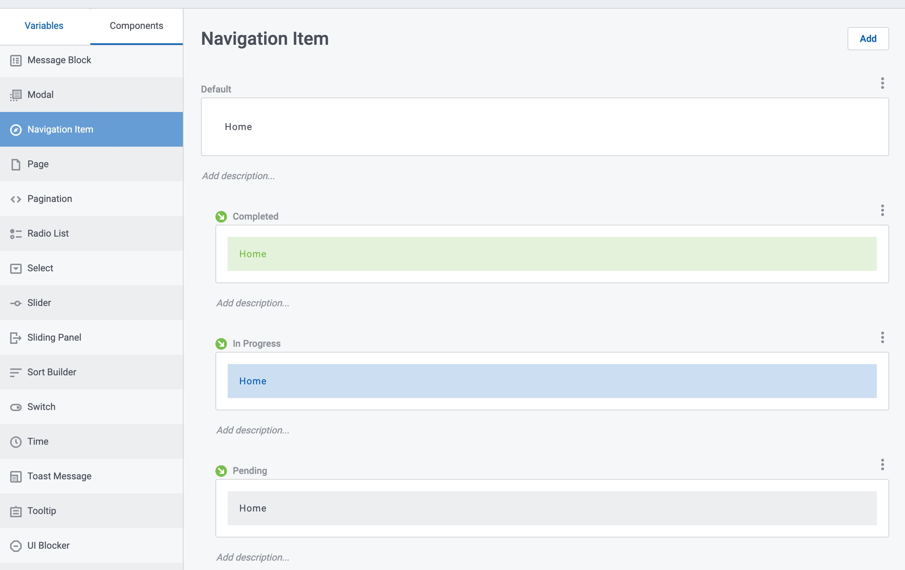

# Navigation for Complex Forms

</img>

Skuid is often used for creating complex forms. These applications need to clearly guide users through multiple pages of questions using a navigation structure that organizes this process
and gives clear feedback about progress. 

## Advanced requirements

Minimum requirements for a navigation structure would be showing a list of sections and letting the user select one of them. However, there are a number of more advanced features that make a complex form more user friendly. It is these advanced features that make for a really interesting application. These requirements include: 

- Highlight the user's progress through the form, showing sections untouched, in progress, actively selected and completed. 
- Display data in the navigation element that summarizes contents in the underlying section, or highlights need for user attention.   
- Disable or hide navigation element based on data.  
- Allow nesting of some sections of the form within in secondary dropdown that can be hidden.   
- Remember the user's place. If the user navigates away from the form (to an underlying detail page), and then hits the back button - open the section where they were last. Similarly, retain the correct context when user refreshes the page. 

## Vertical Navigation component

There are a number of ways you can build out this solution in Skuid.  But we are going to focus on how the Vertical Navigation component provides this functionality.  

**Download the design system and sample page below**, and follow along as we walk through those two major options and show how they are configured. 

### Highlight the users progress through a form  

Each item within a Vertical Navigation component can use style variant conditions to control visual look based on data. Here is how: 

- First: Configure the design system so there are different variants for the navigation item.  In each variant, pay special attention to the selected state as it can provide additional visual interest.  Change the background color, or text font, or the border for a series of scenarios… For your testing make it obvious. 

    </img>

- Second: Create a data structure that assigns values to form completion actions.  In the page below there is a `UI_Control` model that calculates progress within the form by the number of fields that are not blank.  Doing this in UI-only models allows immediate feedback to the user (Without having to save and perform the calculations on the server). 

- Finally: In the navigation item properties in the composer look for style variant conditions to bind the data values to your style variants.  
    - If `Section_1_Completion = 0` then `Pending` variant.   
    - If `Section_1_Completion >0 & <100` then `In Progress` variant. 
    - If `Section_1_Completion = 100` then `Completed` variant. 

### Display data in the navigation element 

You can include model data in the labels of your Vertical Navigation component.  Let users know how many questions there will be before they open a section of the the form . How many questions are still outstanding. You can also use conditional merge syntax to show or hide HTML elements in the navigation labels based on underlying data.  The example page below shows a check mark icon if all questions are complete.  

Note that the Vertical Navigation component is not connected to a model,  so you will have to use global merge syntax  `{{$Model.modelname.data.0.fieldname}}`.  

### Disable navigation element based on data 

Navigation items provide settings for enable conditions.  
- If `Section_1_Completion < 100` don't allow the Section 2 item to be enabled. 

Be careful with this functionality - because it forces a rigidity to your form that users may find problematic.  Ideally you want to let users skip around within the form and complete the process as they have the data - rather than following a rigid process. But we know some processes have to be rigid - so we support them....        

### Secondary dropdown navigation 

This feature is available out of the box with navigation components.  Hover over a primary nav and click the plus button to add “sub navigation” elements.  

### Remember the user's place   

Vertical Navigation components support using url hashes to activate specific items. Give each nav item a unique id, then if that Id is included in the URL as a hash `#uniqueId` - it will be activated on page load, and the actions defined for the nav element will be executed on page load.  

To ensure the hash is present in your URL (so the back button works) add a “Go to URL” action to each nav element that simply goes to the hash. The URL property should just be `#uniqueId`. Most browsers will not force a page reload if only the hash is changed.  But now the URL is correct and the active nav item will be restored if you reload the page, or use the back button to get back into it. 

(The example page below has this built in, but the tightly enforced enable conditions make it difficult to experience)

### Wizard Integration

The Wizard component also has sophisticated controls that allow creation of complex flows.  In the example page below the Wizard and the Vertical Navigation component are bound together,  so that the actions associated with each navigation item and Wizard step button effect the other component as well. 

Look at the action sequences section of the example page for a sequence that is activated when a Wizard button is selected, and another sequence that is activated when a navigation item is selected.  These sequences use `inputs` to control exactly what section is opened or activated.  This means the actions can be defined once and reused throughout the application. 

## Sample page

Below is a sample page that shows all these features of a complex form. You will need to ensure the Design System is installed before copying the page XML into your org.  

- Page API:  V2
- Data source: None
- Design system:  [Download this Design System file](ComplexForm.designsystem?raw=true).  Use the import function on the design system page to add this system to your org.     
- Page XML:  [Copy the XML from this page](ComplexForm.xml?raw=true), or save it as an XML file, and upload it as a new page.  

## Data driven navigation 

A final detour.... 

There are use cases where the sections of the form that are being presented to the user need to be data driven.  The specifics of labels and order will not be set by the Skuid builder - but rather will be derived on the fly based on some other data.  Can a Skuid model be used to drive navigation?   

Well,  lets talk about it...

The Vertical Navigation component can not be bound to a model, and so cannot be truly dynamic. But many of the requirements above can be delivered using Skuid's data iterator components (List or Deck).  This facilitates building out navigation that is based on model data -- a structure that is truly flexible and variable.

### Data model

All the values for the navigation would need to be stored in a data table. This table would include the following fields:   
- Label 
- Icon (use the Skuid icon names) or image  
- Page include to be loaded 
- Other fields that can be filtered to provide the specific set of entries that should be shown

### Highlight the users current selection 

Similar to the Vertical Navigation component - the List component has “selected state control”.   It’s configured on the “Click interaction” node.  It does require a selected state to be configured for the List component of the design system.  Look for the “row” properties.  

If the standard selected state control does not provide enough control,  or if you are using a deck - use style variant conditions on a wrapper or grid in the deck.  Update ui-only fields in your action sequence to highlight the active card.  Make sure you update all rows to “not selected” before you update the current row to “selected”.   
  
### Display data in the navigation element 

Because the iterator components are bound to model data - you can use templates and fields to show the number of questions in a section, or progress data etc.  You can also add HTML to templates in the List. 

You can also use style variant conditions to highlight style of a wrapper in a deck card if certain conditions are met.  Alert to “urgent” attention needed on one navigation element. 

In the List component you can add an icon field type.  Its properties will merge model data - letting you dynamically show an icon defined in your data or derived from user progress.

In the deck component there is no stand alone icon. But you can use the following html in a text component to show the icon:  

```xml
<svg style="width:16px; height:16px">
<use href="{{{Icon}}}"></use>
</svg>
```

### Disable navigation element based on data 

We do not have enable condition logic for the interactions associated with Deck cards or List items.  Instead use branch actions to prevent the action for particular scenarios.  You have to define the actions for each navigation item,  but this allows you to have different logic rules for each item.  Your failure branch can post a message about why the page load is not happening. 
 
### Secondary navigation 

The List component allows drawers.  You can configure the drawers to open on-click or with the secondary drawer icon.   You can put a second List in the drawer and use context conditions to ensure that the correct sub nav items show up under their parents. 

With a deck - a secondary deck can be conditionally rendered only to show when the “selected” flag on a navigation element is true.  A branch on the interaction can set the value back to false if it is already true - and in that way reproduce the open / close toggle of the Vertical Navigation component or List drawers. 

### Remember the user's place

Here the solution is not as straightforward as the Vertical Navigation component. The List will not listen to URL hashes.  If you are already doing some server side work to track progress - leverage that data to open the users view in the right place. On page load, have some separate model that loads the correct page include value and uses a style variant condition to make the correct row of the navigation look selected. 

### What about the details? 

Data driven navigation is interesting, but what about the contents of each of those data driven items?  How do you define what questions should show in each of the possible navigation items.  One option is to use page includes. Build a separate page that contains the questions for each possible navigation item (or form section).  Your navigation control model can have a value for the pageName which can be merged into the page include component.   

To use model data in the page include component action -  will need to add the merge syntax in the XML - like this. 

```xml 
<action type="runComponentAction" componentid="sk-2VJV-18225" action="loadNewPage" pageName="{{Page_Include}}"/>
```

#### More advanced data modeling 

You might also add a junction object that links the navigation element to profile - and in that way limits the items to be shown to the active user. 

You could also add a user status table. 

At the beginning of a process - records would be created for each nav display junction. On subsequent access - these records are used to control the initially selected nav element and to show the user status information about their progress. 
 
Fields:
- UserId
- Nav ID reference. 
- Actual count for Nav ID. 
Use nav ID reference to retrieve all the fields needed to build the navigation structure using this model. Use UI formula fields to compare `actual` to `business rule target` - and in that way trigger style variant conditions to show completion, or escalation, or prioritization, etc...  

## Examples 

The complex data model required to show these solutions make it difficult to provide solutions that can be easily implemented. Please let us know if you would like assistance setting up this form of advanced Skuid implementation.  