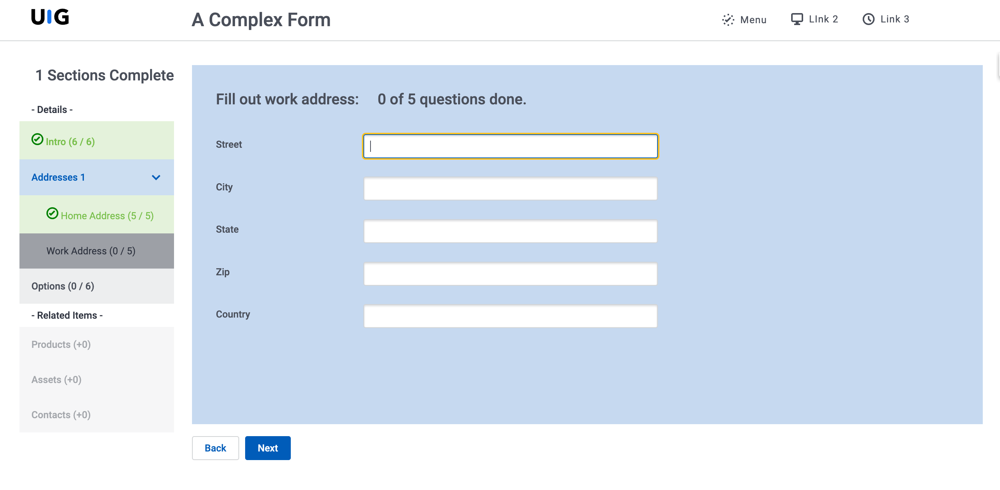

# Studies in Navigation

</img>

Skuid is often used for creating Single Page Apps.  A single page is used as a container to provide a range of different functions that are loaded as needed without completely reloading the web page. Its a more pleasing user experience. To be most effective, this sort of App requires a robust navigation structure that allows users to move back and forth between the various functions. 

This sort of navigation is also helpful for complicated forms. You might have dozens of pages of questions that a user needs to fill out.  A navigation structure to organize that process, and give clear feedback about its progress is really helpful. 

## Advanced Requirements
Aside from showing a list of navigation elements and letting the user select an entry, there are a few more advanced functions that make a navigation system really user friendly. 

- Highlight the user's current navigation selection.  
- Display data in the navigation element that summarizes contents in the underlying pages, or highlights need for user attention.   
- Disable navigation element based on data.  
- Collapsable Nav: Allow a thin “icon only” and a wider “fully labeled" navigation view. Allow the user to switch back and forth easily. 
- Secondary dropdown navigation items.   
- Remember my place. If the user navigates away from the single page app (opening a record detail page), and then hits the back button - open the section where they were last. Similarly, retain the correct context when user refreshes the page) 
-  Data Driven navigation. Dynamically control navigation items shown based on some data we know.


## Navigation: Two basic options 

As is typical with Skuid - there are a number of ways you can build out this solution.  Each one has its pros and cons.  

- The first option is to use the vertical navigation component - which is easier to set up - but not as ultimately powerful (it cannot support data driven use cases).  

- The second option is to use one of Skuid’s data iteration components (list or deck).  This can provide all the complexity you need,  but will be more complicated to set up.

Here we'll walk through those two major options and provide some example pages. 

## Option 1: Navigation component. 

There are two navigation components (vertical and horizontal).  Each are very similar in operation.  I’ll build out vertical nav.   These components cannot be bound to model data,  so you have to define all the navigation options in the page building process.  This does not allow you to build out completely dynamic navigation.  

Here is how to handle the requirements listed above. 

### Highlight the users current selection  
First, configure the design system so the selected state actually is different.  Look for Selected State under the Navigation element node of your design system.  Change the background color, or text font… For your testing make it obvious. 

The navigation components provide a standard selected state support.  But you can enhance this by using display logic (look for Selected conditions).  Maybe you want multiple entries selected, or you want to drive selection from another component - like a wizard button.   

Note that selecting a second nav element will clear all Selected state conditions regardless of whether the selected state condition still is true.  (This is being reported as an enhancement)  

### Display data in the navigation element 
You can include model data in the labels of your navigation component.  Let users know how many open tasks there are before they open that navigation element. How many questions are still outstanding in that section of the survey. You can also use conditional merge syntax to show or hide HTML elements in the navigation labels based on underlying data.  Show that goofy smiley face icon if all tasks are complete.  

Note that the navigation component is not connected to a model,  so you will have to use global merge syntax  `{{$Model.modelname.data.0.fieldname}}`.  In V2, components do not yet listen to changes of data through global merge syntax.  The indicators will not change unless you reload the page.

This challenge might point you to using the data iterator components for your navigation. See below. 

### Disable navigation element based on data.  
We do not have Enable Condition logic for navigation items.  Instead use Branch Actions to disable the navigation item by not allowing the primary actions to be completed. You have to define the branch logic for each navigation item,  but this allows you to have different logic rules for each item.  The failure branch can post a message about why the item is disabled.  

### Collapsible navigation 
You will need to create two copies of the component (one with label and the other without) and use a ui-only field to control which shows.  Put a form control at the bottom of your navigation to let the user indicate if they want the collapsed or expanded navigation. 

When global model listening is implemented - use conditional merge syntax to show or hide the label.
```xml
{{#$Model.UIModel.data.0.CollapsedNav}}””{{/$Model.UIModel.data.0.CollapsedNav}}{{^$Model.UIModel.data.0.CollapsedNav}}Label Title{{/$Model.UIModel.data.0.CollapsedNav}}
```

### Secondary dropdown navigation 
This feature is available out of the box with Navigation components.  Hover over a primary nav and click the plus button to add “sub navigation” elements. 

### Remember my place.   
Navigation components support using url hashes to activate specific items.   Give each nav item a unique id,  then if that Id is included in the URL as a hash `#UniqueId` - it will be activated on page load, and all the actions defined for the nav element will be executed.  

To ensure the hash is present in your URL (so the back button works) add a “Go to URL” action to each nav element that simply goes to the hash. The URL property should just be `#UniqueId`. Most browsers will not force a page reload if only the hash is changed.  But now the URL is correct and the active nav item will be restored if you reload the page, or use the back button to get back into it. 

### Data Driven navigation.  
Though the Navigation component can not be bound to a model.  You can use conditional rendering to control whether navigation elements show or not.  (Profile X does not see nav elements 2, 5 and 7).  

But if you want truly data driven nav - read on.... 

## Examples: 
Below are two pages that use the Vertical Navigation Component. 

You will need to ensure the Design System used has Selected State defined so it is noticeable. 

### Vertical navigation 
- Page API:  V2
- Data source: None
- Design system: See Note 
- Page XML:  [Copy the XML from this page](Veritcal_Nav.xml), or save it as an XML file, and upload it as a new page.  

### Integration of wizard and vertical navigation 
- Page API:  V2
- Data source: None
- Design system: None 
- Page XML:  [Copy the XML from this page](Wizard_Nav_Integration.xml), or save it as an XML file, and upload it as a new page.  


## Option 2:  List or deck component

The same requirements - but now delivered using our data iterator components.  This facilitates building out navigation that is based on Model data -- a truly flexible and infinitely variable navigation. 

### Highlight the users current selection 
Similar to the Navigation component - the List component has “selected state control”.   It’s configured on the “Click interaction” node.  It does require a selected state to be configured for the List component of the design system.  Look for the “row” properties.  

If the standard selected state control does not provide enough control,  or if you are using a Deck - use style variant conditions on a wrapper or grid in the deck.  Update ui-only fields in your action sequence to highlight the active card.  Make sure you update all rows to “not selected” before you update the current row to “selected”.   
  
### Display data in the navigation element 
Because the iterator components are bound to model data - it is easier to use data.  You can also add HTML to templates in the list. 

You can also use style variant conditions to highlight style of a wrapper in a deck card if certain conditions are met.  Alert to “urgent” attention needed on one navigation element. 

### Disable navigation element based on data.  
We do not have Enable Condition logic for the interactions associated with Deck Cards or List items.  (Enhancement!)   Instead use Branch Actions to prevent the action for particular scenarios.  You have to define the actions for each navigation item,  but this allows you to have different logic rules for each item.  Your failure branch can post a message about why the page load is not happening. 

### Collapsable Nav 
Just like the vertical navigation component  - the most straightforward method to have collapsibility is to have 2 components and use conditional rendering to only show one. 

The list component needs to implement column based conditional rendering.  (Enhancement!) 

A deck component will not work so well here.  The collapsed state will want to wrap individual cards instead of shrinking the entire column.   This is a work in progress. 
 
### Secondary navigation 
The list component allows drawers.  You can configure the drawers to open on click or with the secondary drawer icon.   You can put a second list in the drawer and use context conditions to ensure that the correct sub nav items show up under their parents. 

A current limitation is that the selected state of child lists do not interact with the selected state of the parent list.   Also - it would be really nice to have “close all drawers” action so that when one parent item is selected - it first closes all the others.  

With a Deck - a secondary deck can be conditionally rendered only to show when the “selected” flag on a navigation element is true.  A branch on the interaction can set the value back to false if it is already true - and in that way reproduce the open / close toggle of the navigation component or list drawers. 

### Remember my place. 
Here the solution is not as straightforward as the navigation component. The list will not listen to URL Hashes.  If you are already doing some server side work to track progress - leverage that data to open the users view in the right place. On page load, have some separate model that loads the correct page include value and uses a style variant condition to make the correct row of the navigation look selected. 

### Data Driven navigation. 
With a list - you can retrieve model data to drive exactly what will show on the page.  This would allow you to control the navigation by user, or by profile, or by progress made. 

Here are a few notes on setting this up. 

All the values for the navigation need to be stored in a data table. This would include  
- Label 
- Icon (use the Skuid icon names) or image  
- Page include to be loaded 
- Business rule target

In the list - add an icon field type.  It's properties will merge model data - letting you dynamically show the icon defined in your data. 
In a Deck there is no stand alone icon. But you can use the following html in a text component to show the icon:  

```xml
<svg style="width:16px; height:16px">
<use href="{{{Icon}}}"></use>
</svg>
```

To use model data in the page include component action -  will need to add the merge syntax in the XML - like this. 
```xml 
<action type="runComponentAction" componentid="sk-2VJV-18225" action="loadNewPage" pageName="{{Page_Include}}"/>
```
#### More advanced data modeling: 
You might also add a junction object that links the Nav element to Profile - and in that way limits the items to be shown to the active user. 

You could also add a user status table. 
At the beginning of a process - records would be created for each Nav Display junction. On subsequent access - these records are used to control the initially selected nav element and to show the user status information about their progress. 
 
Fields:
- UserId
- Nav ID reference. 
- Actual count for Nav ID. 
Use Nav ID reference to retrieve all the fields needed to build the navigation structure using this model. Use UI formula fields to compare Actual to Business Rule Target - and in that way trigger style variant conditions to show completion, or escalation, or prioritization...  

## Examples 
The complex data model required to show these solutions make it difficult to provide solutions that can be easily implemented. Please let us know if you would like assistance setting up this form of advanced Skuid implementation.  
