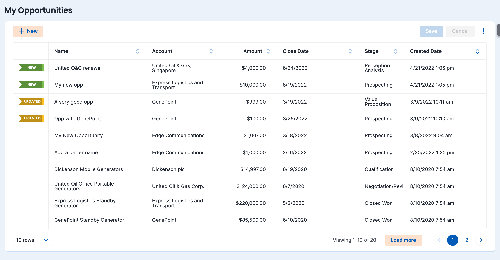

# Add a flag for new or recently updated records on a Table component

</img>

## Instructions
- Page API:  V2
- Data source: Uses default Salesforce data source
- Design system: ProductTour (available out of the box)
- Page XML:  [Copy the XML from this page](NewUpdatedFlag.xml), or save it as an XML file, and upload it as a new page in your Salesforce Org.  

## Notes
This sample page highlights DATE_DIFF function and template field on table component.
- To see the Updated flag in action, make a change to a record and click Save
- To see the New flag in action, create a new record and Save
- The formula is currently set to show the flag if the record is new or updated within an hour. To change the unit (to a day for example), update the unit in the DATE_DIFF function from HOUR to DAY

## Related Links
- [Date diff function](https://docs.skuid.com/latest/en/skuid/formula-function.html#date-time-format-and-manipulation)
- [Merge Syntax](https://docs.skuid.com/latest/v2/en/skuid/merge-syntax/#conditional-merge-expressions)
- [Template field](https://docs.skuid.com/latest/v2/en/skuid/fields/#template-fields)
