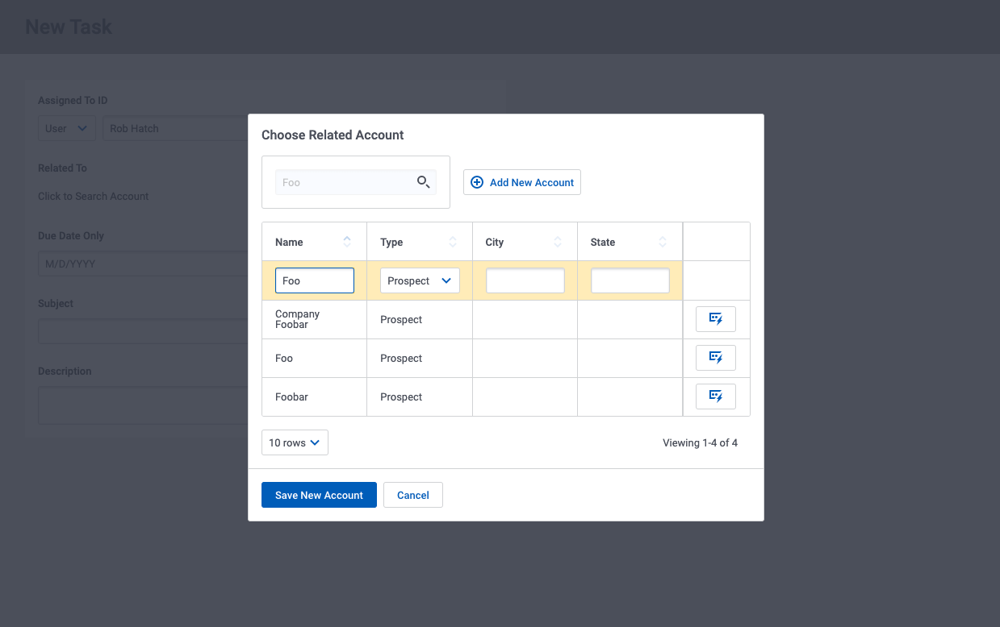

# Custom Reference Field Selection Popups

Skuid offers powerful reference field editing capabilities out of the box. This includes configuration for search and additional details popups. But often there are additional requirements for interacting with reference fields not satisfied by the standard Skuid reference field. 

Template interactions give you the possibility of completely customizing the experience of interacting with a reference field. 

In the example below - when creating a new task, account selection opens a popup where you can search for existing accounts, or create a new account that is automatically added to the task as it is saved.  

</img>

## Instructions  
- Page API:  V2
- Data source: Uses default Salesforce data source
- Design system: None 
- Page XML:  [Copy the XML from this page](ReferenceSelectionPopup.xml?raw=true), or save it as an XML file, and upload it as a new page.  

## Notes
Here are the key areas to be reviewed. 
-  The key to this technique is the template field in the new task form.  Look at the `Interactions` properties of the "Related To" template.  
-  The popup that is exposed in that interaction uses a second "accounts" model. It is empty by default, but uses search function to retrieve records. 
- Conditional rendering hides the accounts table when no rows are present, and hides the "save / cancel" buttons if only existing accounts are present. 
- In the template interaction - a branch is used to proactively search the accounts model if there is a value in the "related to field"  This makes the popup a "more information" tool, as well as a "select a new account" tool. 
- The "Related To" template uses conditional merge syntax to show placeholder text if no account has been selected, and to show the selected account name once it has been defined. 
- Action sequences behind the account table row action, and the new account Save button move the Id of the selected account to the new task model.  

Improvements. 
- The new account function could use a `form` component to make the new record data entry more user friendly. 
- In your design system, style the "Related to" template so it looks more clickable.  Maybe add a search icon.
- The "Related To" template could use HTML to change styles when an account is selected. 

## Related Links

- [Internal link in Demo Org](https://skuid-demo--skuid.na137.visual.force.com/apex/skuid__PageBuilder?id=a094U00001p1KBzQAM) (for Skuid Employees only)