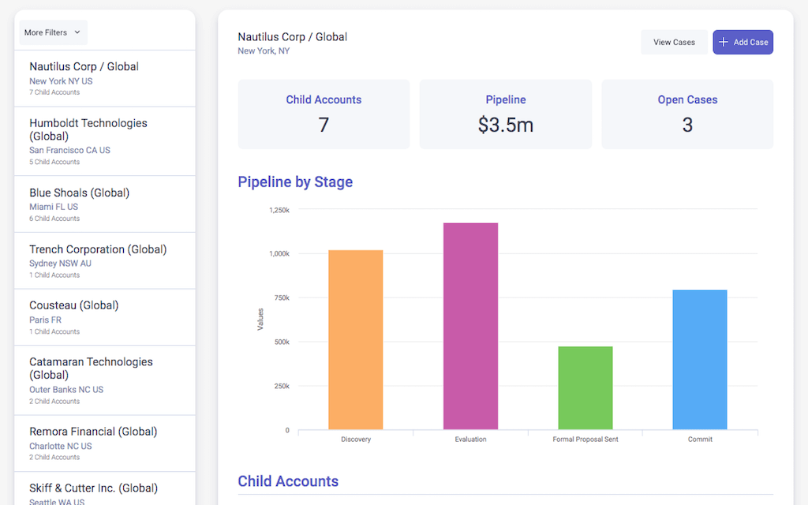

# Account Hierarchy View

Easily traverse Account Hierarchies in a single screen while presenting interactive data from multiple related objects. 

</img>

The list of Accounts on the left is filtered to only display Global/Parent accounts. Select a Parent Account from the List and the detail view displays all the Child Accounts that look up to the parent you've selected. Each child account displays related opportunities - with two separate views: Open Opportunities and Closed Opportunities. You can also view all the cases related to any of the accounts in the selected hierarchy or easily create a new case and select which Account the new Case should be related to (using a reference field that is being displayed as pick-list).

## Instructions
- Page API:  V2
- Data source: Uses default Salesforce data source
- Design system: [Download this Design System file](Salesforce_Demo.designsystem).  Use the Import function on the Design System page to add this system to your org. 
- Page XML:  [Copy the XML from this page](Account_Hierarchy.xml), or save it as an XML file, and upload it as a new page in your Salesforce Org.  

## Notes

- The chart allows you to drill down into the underlying Opportunity data and make changes if necessary.
- The KPIs are Skuid UI Only Formula fields - so you do not need to worry about using up any of your roll-summary fields on your Account Object.
- The Modal that appears when clicking "New Case" is completely configurable and no code was necessary - it's one of the many actions available to call from Skuid's Action Framework ("Show Modal")
- You can style buttons and place them anywhere on the page, highly configurable and powerful components that hook into the Action Framework and/or Salesforce actions (approval process, Apex, etc.).

## Related Links
- [Internal link in Demo Org](https://skuid-demo.lightning.force.com/lightning/n/Account_Navigator) (for Skuid Employees only)