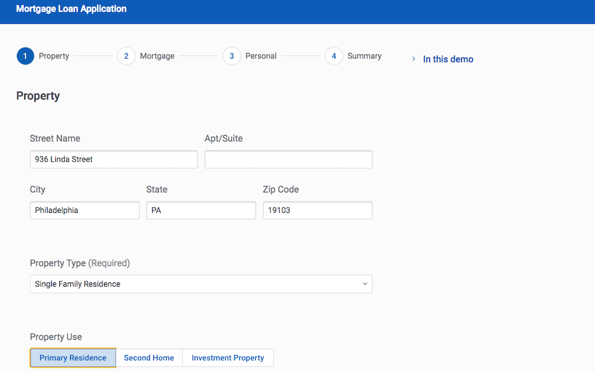

#Complex Form - Mortgage Loan Application.  

The Mortgage Loan Application guides users applying for a mortgage with an intuitive step-by-step process. Administrators can add conditional rendering and field-level validation to create an optimal workflow. Drive customer success by showing the right questions at the right time.

</img>

## Instructions:  
- V2 Page API Used
- Data source: Uses default Salesforce data source
- Design system: [Download this Design System file](https://github.com/skuid/SamplePages/blob/master/Use_Cases/SamplePages.designsystem), and use the Import function on the Design System page to add this system to your org. 
- Page XML:  [Copy the XML from this page](Complex_Form.xml), or save it as an XML file, and upload it as a new page in your Salesforce Org.  

## Notes:

## Related Links: 
- [View page in App Gallery](https://portal.skuidsite.com/designsystem/applications/detail/mortgage)
- [Internal link in Demo Org](https://skuid-demo--skuid.na37.visual.force.com/apex/skuid__ui?page=SamplePages_ComplexForm) (for Skuid Employees only)
