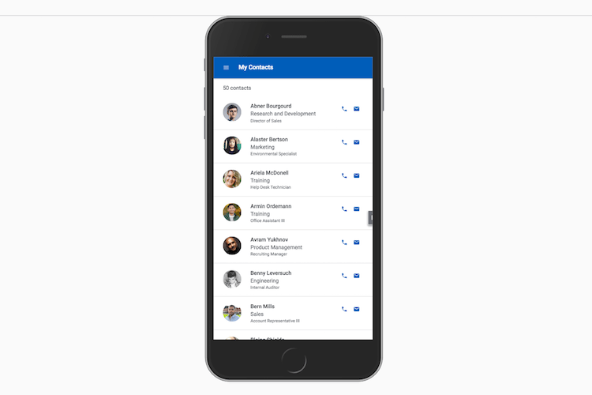

# List view optimized for small form factor

When you need a list of records on a phone - or other small form factor.

</img>

## Instructions:  
- V2 Page API Used
- Data source: Uses default Salesforce data source.   
- Design system: [Download this Design System file](https://github.com/skuid/SamplePages/blob/master/Use_Cases/SamplePages.designsystem), and use the Import function on the Design System page to add this system to your org. 
- Page XML:  [Copy the XML from this page](MobileList.xml), or save it as an XML file, and upload it as a new page in your Salesforce Org.  

## Related Links: 
- [View page in App Gallery](https://portal.skuidsite.com/designsystem/samplepages/preview/mobilelist)

For best results use your browser's developer tools to emulate a phone or tablet form factor. 

- [Internal link in Demo Org](https://skuid-demo--skuid.na37.visual.force.com/apex/skuid__ui?page=SamplePages_MobileList) (for Skuid Employees only)

