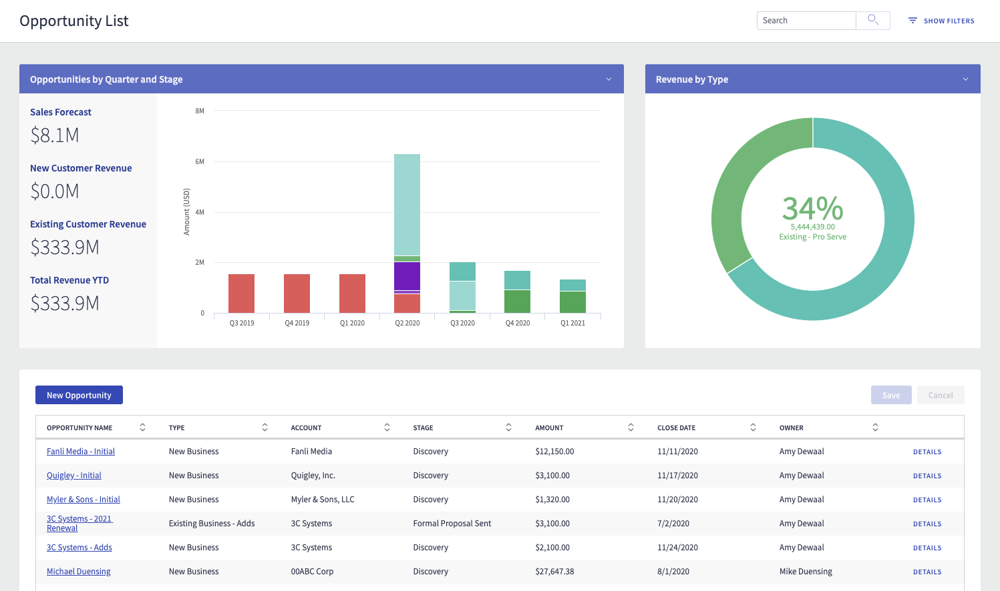

# Opportunity List

Easily view opportunities in a single screen both in chart and table format

</img>

The table shows all opportunities, while the charts and KPIs offer an overview. 
With this page you can do any of the following: 
- Search or filter to drill down to the opportunities you want to see
- Click on portions of a chart to drill down and see the opportunities in that section
- Create a new opportunity using a step-by-step process

## Instructions
- Page API: V2

- Data source: Uses default Salesforce data source

- Design system: [Download this Design System file](CompactOpportunityMgt.designsystem). Use the Import function on the Design System page to add this design system to your org.

- Page XML: [Copy the XML from this page](Opportunity_List.xml), or save it as an XML file, and upload it as a new page in your Salesforce org.

## Notes
- Add filters through the Show Filters action, then hide them for more screen real estate while continuing to see the active filters on the table.

- The KPIs are Skuid UI-Only Formula fields - so you do not need to worry about using up any of your roll-summary fields on your Account object.

- The Modal that appears when clicking "New Opportunity" is completely configurable and no code was necessary - it's one of the many actions available to call from Skuid's Action Framework ("Show Modal").

## Related Links
-  [View page in App Gallery](https://portal.skuidsite.com/applications/opportunitymanagement)