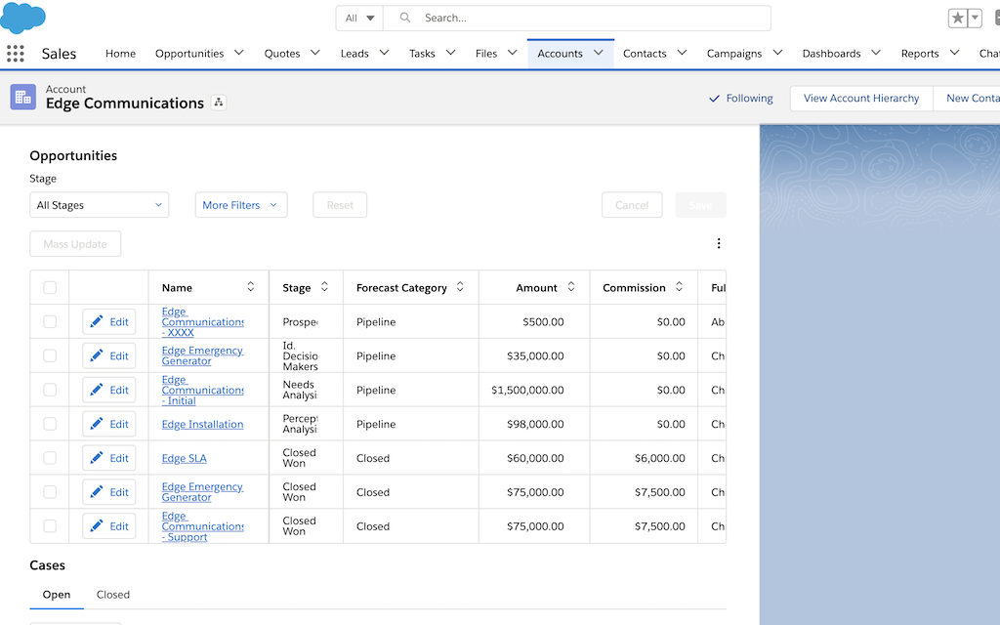
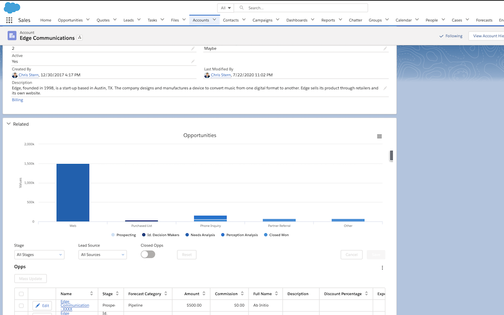

# Better Related Lists

The Lightning Account detail page is extended by using Skuid to display related opportunities and cases with advanced filtering, sorting, and interactive capabilities. The related lists have multi-field sorting, 10+ columns that can be shown/hidden by individual end users, dynamic filtering of opportunities, two views of cases (one tab displays open cases, second tab displays closed cases), and a dashboard displaying real time opportunity information.

</img>

</img>

## Instructions
- Page API:  V2
- Data source: Uses default Salesforce data source
- Design system: [Download this Design System file](Skuid_Appetizer.designsystem).  Use the Import function on the Design System page to add this system to your org. 
- Page XML:  [Copy the XML from this page](FilteredLists.xml), or save it as an XML file, and upload it as a new page in your Salesforce Org.  
- You can preview this page by itself to see the Skuid functionality,  but to see it on the Lightning Detail page you will have to add the Skuid Page component to a Lightning Page  and refer to this page there. 

## Notes

- End users can select which columns they want to display by clicking the 3 dot menu at the top right of the table. They also have the ability to export all the records in the table into a .csv. End users can inline edit the related records across both the Opportunity and Case object simultaneously - saving changes on both objects with just one click.

- In addition to inline editing, users can efficiently mass update related records without needing to leave the detail page.

- The “Lead Source” column on the table of Opportunity records is dynamic - conditionally rendering only when the Parent Account’s “Type” field is equal to “Prospect”. Skuid components can listen to changes in Lightning components and reflect those changes immediately. Conditional rendering works across objects and dynamically displays components, fields, columns, buttons, etc. - ensuring the user sees the data they need when and where they need to see it.

## Related Links
- [Documentation about Skuid Lightning Component](https://docs.skuid.com/latest/v2/en/skuid/deploy/salesforce/lightning/#the-skuid-page-lightning-component)
