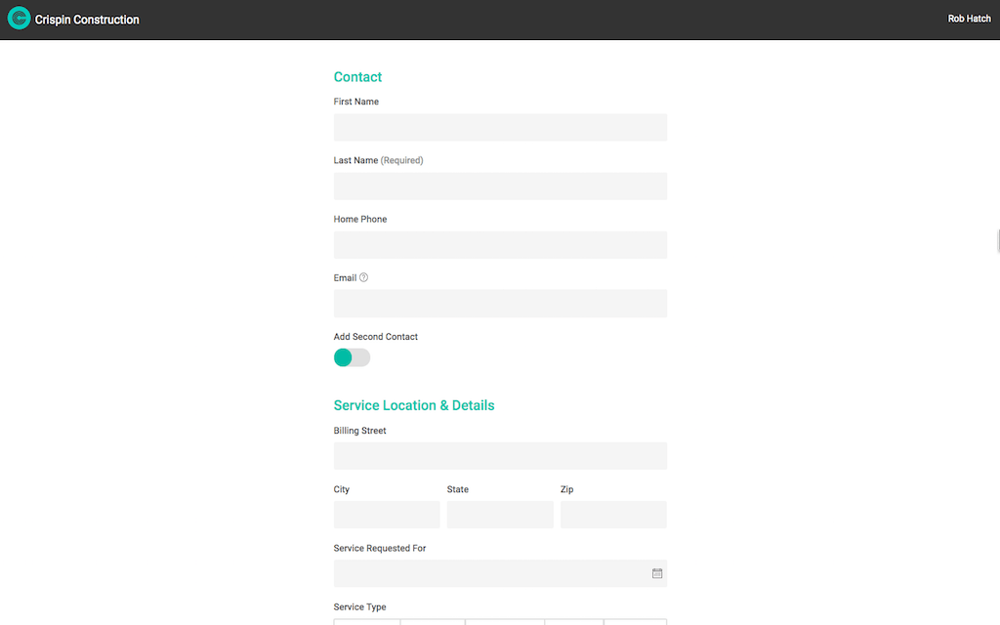

# Service Request Form

This page shows how Skuid can take a complicated data model and create very simple UI for it,  without writing any code. 

</img>

In the standard CRM data model,  there is good reason to have records separated out into categories.  It makes sense to keep Accounts, Contacts, Opportunities, Cases and Tasks all in different objects.  But in the standard Lightning Experience, it is difficult to present an simple user interface while interacting with all these objects and records.  Each record in each objects is often a different popup or page. 

However, With Skuid you can make a very simple looking form,  that creates records in all these objects. 

## Instructions:  
- V2 Page API Used
- Data source: Uses default Salesforce data source
    - This page uses the following custom fields on the case object.  You will need to set these fields up for the optimal experience. 
        - `Additional_Contact__c`:   A lookup to contact. 
        - `Service_Requested_For__c`: A date field. 
- Design system: [Download this Design System file](CrispinConstruction.designsystem).  Use the Import function on the Design System page to add this system to your org. 
- Page XML:  [Copy the XML from this page](Service_Request.xml), or save it as an XML file, and upload it as a new page in your Salesforce Org.  

## Notes:

- Multiple models.  Interacting with various objects throughout the Salesforce data model. Each configured to create a new row on page load. 
- Ui Only Fields:   Look at the contact model.  An "Additional Contact" boolean is in that model.  It is connected to model actions that trigger creation of a new row in the "Additional Contact" model. 
- Seamless form UI. Notice that there are lots of forms on the page.  Each is bound to a different model.  But at run-time it appears to be a single - well designed - form. 
- Conditional rendering by viewport:  The Service Type field appears twice.  If a larger viewport - it shows as a button list.  If a smaller viewport - it shows as a pick-list. 
- Submit Request button:   Notice the set of actions that saves information in each model,  moves reference data into the case and finishes with an elegant confirmation modal. 

Note: This application is frequently used in the Skuid "Build an App Workshop" where users who are new to Skuid build for themselves a complicated real-world application in less than 90 minutes. 

## Related Links: 

- [Internal link in Demo Org](https://skuid-demo--skuid.na37.visual.force.com/apex/skuid__ui?page=ServiceRequests) (for Skuid Employees only)

