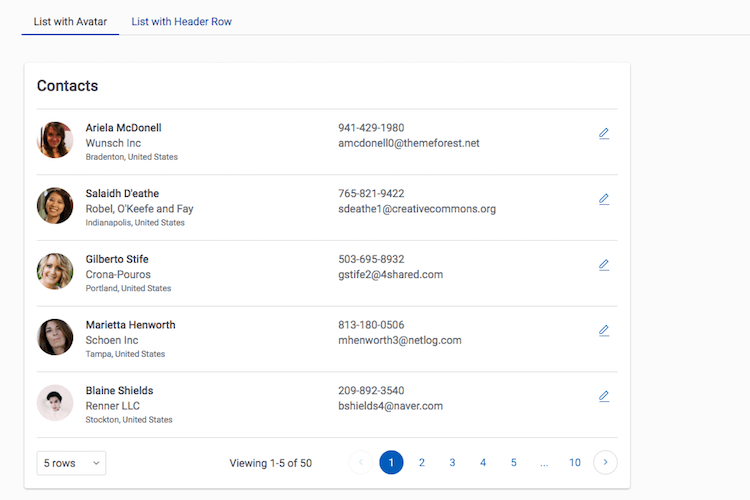

# Simple List

Very scannable tables, displaying a robust amount of data with stacked columns.

</img>

## Instructions
- Page API:  V2
- Data source: Uses default Salesforce data source.   
- Design system: [Download this Design System file](https://github.com/skuid/SamplePages/blob/master/Use_Cases/SamplePages.designsystem), and use the Import function on the Design System page to add this system to your org. 
- Page XML:  [Copy the XML from this page](Simple_List.xml), or save it as an XML file, and upload it as a new page in your Salesforce Org.  

## Related Links
- [View page in App Gallery](https://portal.skuidsite.com/designsystem/samplepages/preview/simplelist)
- [Internal link in Demo Org](https://skuid-demo--skuid.na37.visual.force.com/apex/skuid__ui?page=SamplePages_SimpleList) (for Skuid Employees only)

